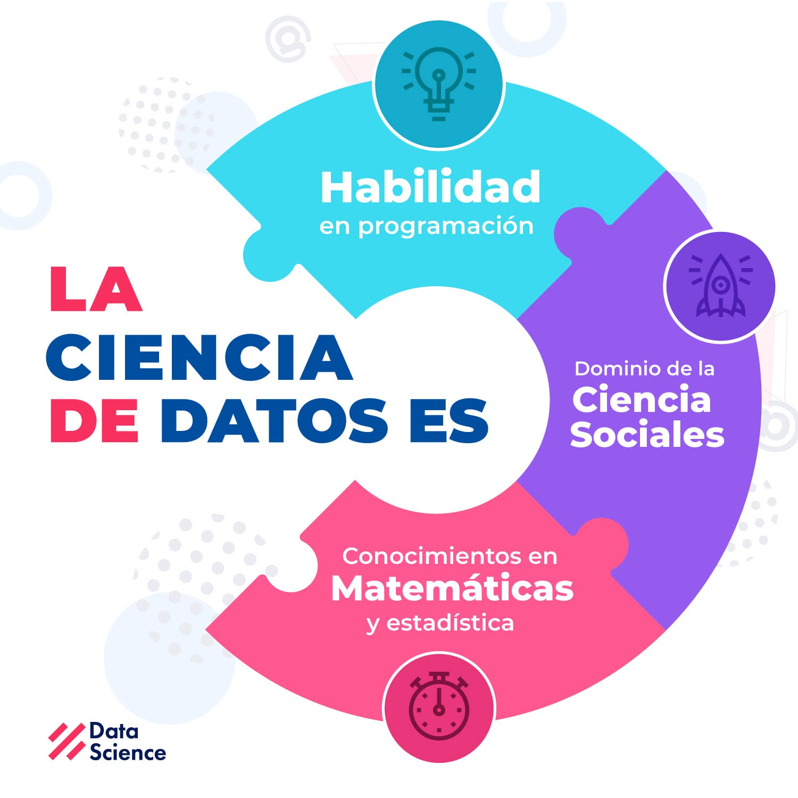

## Introducción

:::: {.columns}

::: {.column width="45%"}
La ciencia de datos es una disciplina interdisciplinaria que combina estadística, computación y conocimiento del dominio para transformar datos en información útil que apoye la toma de decisiones.
:::

::: {.column width="55%"}
{fig-align="center" width="90%"}

::: {.figure-source}
Fuente: Data Science Research Perú (Facebook, 2020).
:::

:::

::::

## Flujo de trabajo en ciencia de datos

{fig-align="center" width="100%"}

::: {.figure-source}
Fuente: Data Science Research Perú (Facebook, 2025).
:::

## Roles en ciencia de datos

| Rol | Objetivo |
|:---|:---|
| **Ingeniero de Datos** | Construir y mantener la infraestructura de datos. |
| **Analista de Datos** | Obtener información útil para apoyar decisiones. |
| **Científico de Datos** | Construir modelos que expliquen o predigan fenómenos. |

## Ingeniero de Datos

Su principal responsabilidad es garantizar que los datos estén disponibles, organizados y sean confiables.

::: {style="font-size:85%;"}

- **Integración de datos:** combinar múltiples fuentes de información.
- **Bases de datos:** diseñar y administrar sistemas de almacenamiento.
- **ETL / ELT:** extraer, transformar y cargar datos.
- **Automatización:** automatizar tareas y procesos de datos.
- **Calidad de datos:** detectar y corregir inconsistencias.
- **Pipelines:** construir flujos de procesamiento de datos.

:::

## Analista de datos

Su objetivo es transformar datos en información que facilite la toma de decisiones.

::: {style="font-size:85%;"}

- **Consultas SQL:** consultar y filtrar información.
- **Dashboards:** diseñar paneles de indicadores.
- **Estadística descriptiva:** resumir y explorar datos.
- **Visualización:** comunicar resultados mediante gráficos.

:::

## Científico de datos

Su trabajo consiste en desarrollar modelos capaces de describir, clasificar o predecir fenómenos a partir de datos.

- **Machine Learning:** entrenar modelos de aprendizaje.
- **Estadística:** analizar e interpretar datos.
- **Optimización:** desarrollar modelos de optimización.
- **Predicción:** estimar resultados futuros.
- **Experimentación:** diseñar y evaluar experimentos.

## Comparación

| Actividad            | Ingeniero | Analista | Científico |
| -------------------- | :-------: | :------: | :--------: |
| Bases de datos       |     ✓     |          |            |
| ETL                  |     ✓     |          |            |
| SQL                  |     ✓     |     ✓    |      ✓     |
| Visualización        |           |     ✓    |      ✓     |
| Machine Learning     |           |          |      ✓     |
| Modelado estadístico |           |     ✓    |      ✓     |

## Resumen

- La ciencia de datos combina estadística, computación y conocimiento del dominio para transformar datos en información útil.

- Los ingenieros, analistas y científicos de datos cumplen funciones distintas, pero colaboran para resolver un mismo problema.

- El modelado de datos proporciona las herramientas para analizar información, construir modelos y apoyar la toma de decisiones.

## Referencias

::: {#refs}
:::

## Preguntas

:::: {.columns}

::: {.column width="45%"}
{width=95%}
:::

::: {.column width="55%"}
::: {.vcenter}

 ¿Seguro? 🤨 

Bueno...

Pregúntale a [ChatGPT](https://chatgpt.com) pues.

:::
:::

::::

## ¿Qué sigue?

En la siguiente sesión conoceremos el flujo general del análisis de datos, desde la obtención de los datos hasta su exploración inicial. Cada una de estas etapas será desarrollada con mayor detalle en las lecciones posteriores.

- Tipos y fuentes de datos.
- Adquisición y extracción de datos.
- Preparación de datos.
- Análisis exploratorio de datos.

[**Ir a la lección →**](leccion-02.qmd)
