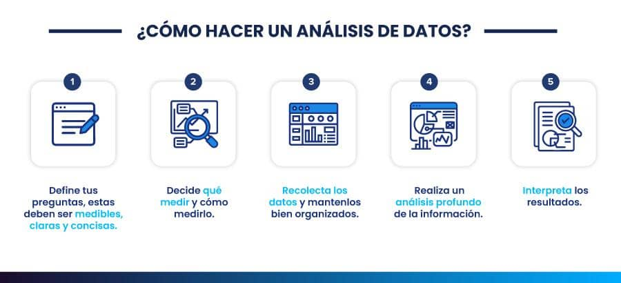

## Introducción

El análisis de datos es un proceso estructurado que permite transformar datos en información útil para responder preguntas y apoyar la toma de decisiones.

## El proceso de análisis de datos

{width=95%}

::: {.figure-source}
Fuente: QuestionPro, *Análisis de datos*.
:::

## Tipos y fuentes de datos

:::: {.columns}

::: {.column width="20%"}

{width=90%}

:::

::: {.column width="80%"}

**Tareas**

- Identificar las variables necesarias.
- Definir qué información se requiere.
- Seleccionar las fuentes de datos.
- Evaluar la disponibilidad y calidad de los datos.

:::

::::

## Adquisición y preparación de datos

:::: {.columns}

::: {.column width="20%"}

{width=90%}

:::

::: {.column width="80%"}

**Tareas**

- Obtener los datos desde las fuentes seleccionadas.
- Integrar información de múltiples orígenes.
- Limpiar errores e inconsistencias.
- Transformar los datos para su análisis.

:::

::::

## Exploración y análisis

:::: {.columns}

::: {.column width="20%"}

{width=90%}

:::

::: {.column width="80%"}

**Tareas**

- Explorar la estructura de los datos.
- Identificar patrones y relaciones.
- Detectar valores atípicos y anomalías.
- Generar información para apoyar decisiones.

:::

::::

## Resumen

- El análisis de datos sigue un proceso estructurado para responder preguntas mediante el uso de datos.

- Las primeras etapas consisten en identificar los datos necesarios, obtenerlos y prepararlos para su análisis.

- La exploración de los datos permite comprender su comportamiento antes de construir modelos.

## Referencias

::: {#refs}
:::

## Preguntas

:::: {.columns}

::: {.column width="45%"}
{width=95%}
:::

::: {.column width="55%"}
::: {.vcenter}

 ¿Seguro? 🤨 

Bueno...

Pregúntale a [ChatGPT](https://chatgpt.com) pues.

:::
:::

::::

## ¿Qué sigue?

En la siguiente sesión aprenderemos a identificar los principales **tipos de datos** y las **fuentes de información** utilizadas en proyectos de análisis de datos.

[**Ir a la lección →**](leccion-03.qmd)