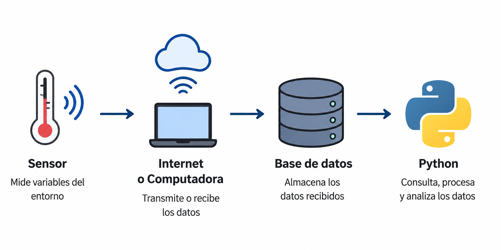

## Introducción

Una vez identificadas las fuentes de datos, el siguiente paso consiste en obtener la información necesaria para su análisis.

En esta lección conoceremos las principales formas de adquirir datos utilizando Python.

## ¿Qué es la adquisición de datos?

La adquisición de datos es el proceso de obtener información desde una o varias fuentes para utilizarla en un proyecto de análisis de datos.

Los datos pueden obtenerse desde:

- Archivos.
- Bases de datos.
- APIs.
- Sitios web.
- Sensores y dispositivos


## Archivos

Los datos suelen descargarse como archivos en formatos como CSV, Excel o JSON. En Python, estos pueden leerse fácilmente mediante la biblioteca **pandas**.

```python
import pandas as pd

df = pd.read_csv("datos.csv")
df = pd.read_excel("datos.xlsx")
df = pd.read_json("datos.json")
```

## Bases de datos

Muchas organizaciones almacenan sus datos en bases de datos relacionales. En Python, es posible consultar esta información mediante consultas **SQL**.

```python
import pandas as pd
from sqlalchemy import create_engine

engine = create_engine("sqlite:///chinook.db")

df = pd.read_sql("SELECT * FROM customers", engine)
```

## APIs

Muchas organizaciones ofrecen APIs para compartir información mediante Internet. En Python, es posible acceder a estos datos realizando solicitudes **HTTP**.

```python
import requests

url = (
    "https://api.open-meteo.com/v1/forecast"
    "?latitude=31.74&longitude=-106.49&current=temperature_2m"
)

response = requests.get(url)
data = response.json()
```

## Sitios web

Cuando los datos no están disponibles para descarga o mediante una API, es posible extraer información directamente desde una página web.

```python
import pandas as pd

url = "https://en.wikipedia.org/wiki/List_of_countries_and_dependencies_by_population"
tables = pd.read_html(url)
```

## Sensores y dispositivos

En aplicaciones científicas e industriales, los datos pueden generarse directamente mediante sensores e instrumentos de medición.

{fig-align="center" width="90%"}

::: {.figure-source}
Fuente: Imagen generada con ChatGPT.
:::

## Resumen

- Los datos pueden obtenerse desde múltiples fuentes.
- Python proporciona herramientas para acceder a estas fuentes.
- Estas técnicas se aplicarán en el primer laboratorio del curso.

## Referencias

::: {#refs}
:::

## Preguntas

:::: {.columns}

::: {.column width="45%"}
{width=95%}
:::

::: {.column width="55%"}
::: {.vcenter}

<div class="fragment"> ¿Seguro? 🤨 </div>

<div class="fragment">Bueno...</div>

<div class="fragment">Pregúntale a [ChatGPT](https://chatgpt.com) pues.</div>

:::
:::

::::


## ¿Qué sigue?

En el laboratorio pondremos en práctica estas herramientas para obtener datos desde diferentes fuentes y construir nuestros primeros conjuntos de datos.

- Lectura de archivos CSV, Excel y JSON.
- Consumo de una API.
- Extracción básica desde un sitio web.
- Creación de un DataFrame.

[**Ir al Notebook 1 →**](../../notebooks/unidad-01/notebook-01.ipynb)
