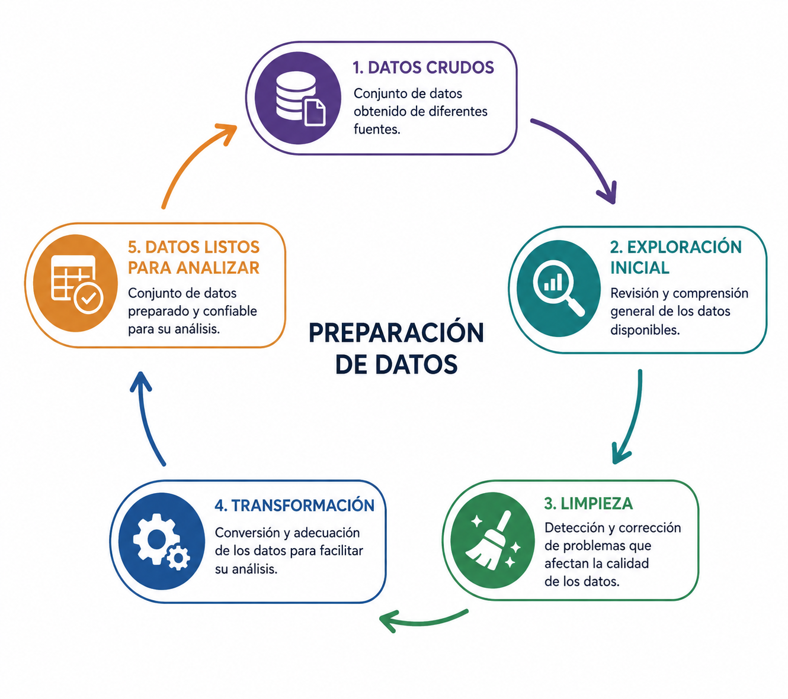

## Introducción

Los datos obtenidos de diferentes fuentes rara vez están listos para analizarse. Antes de utilizarlos, es necesario prepararlos para mejorar su calidad y facilitar su procesamiento.


## ¿Qué es la preparación de datos?

:::: {.columns}

::: {.column width="50%"}
La preparación de datos es el conjunto de actividades que transforman datos crudos en un conjunto de datos listo para su análisis.

Su objetivo es mejorar la **calidad**, **consistencia** y **utilidad** de la información.
:::

::: {.column width="50%"}
{width=100%}
:::

::::

## Exploración inicial

El primer paso consiste en comprender el conjunto de datos y detectar posibles problemas antes de realizar cualquier modificación.

**Ejemplos**

- Identificar el tipo de cada variable.
- Revisar el número de registros.
- Detectar valores faltantes.
- Buscar valores inusuales.

## Exploración inicial con Python

Las bibliotecas de análisis de datos proporcionan funciones que permiten explorar rápidamente la estructura y calidad de un conjunto de datos.

```python
df.info()         # Muestra la estructura del conjunto de datos

df.shape          # Obtiene el número de filas y columnas

df.isna().sum()   # Cuenta los valores faltantes

df.describe()     # Calcula estadísticas descriptivas
```

## Limpieza de datos

La limpieza busca corregir problemas que puedan afectar la calidad de los datos y, por lo tanto, los resultados del análisis.

**Ejemplos**

- Eliminar registros duplicados.
- Corregir errores de captura.
- Tratar valores faltantes.
- Detectar valores atípicos.

## Limpieza de datos con Python

Las bibliotecas de análisis de datos ofrecen funciones para corregir algunos de los problemas más comunes encontrados durante la exploración.

```python
df.drop_duplicates()   # Elimina registros duplicados

df.fillna(0)           # Reemplaza valores faltantes por 0

df.dropna()            # Elimina registros con valores faltantes

df.clip(lower=0)       # Reemplaza valores menores que 0 por 0
```

## Transformación de datos

Una vez limpios, los datos pueden transformarse para facilitar su análisis y procesamiento.

**Ejemplos**

- Convertir tipos de datos.
- Normalizar o escalar variables.
- Crear nuevas variables.
- Cambiar el formato de fechas.

## Transformación de datos con Python

Las bibliotecas de análisis de datos permiten transformar la información para adaptarla a las necesidades de un análisis o modelo.

```python
# Convierte el tipo de dato a entero
df["edad"] = df["edad"].astype(int)

# Normaliza una variable
df["peso"] = (df["peso"] - df["peso"].mean()) / df["peso"].std()

# Crea una nueva variable
df["total"] = df["precio"] * df["cantidad"]

# Convierte una fecha
df["fecha"] = pd.to_datetime(df["fecha"])
```

## Datos listos para analizar

Al finalizar la preparación, se obtiene un conjunto de datos consistente y confiable que puede utilizarse para generar estadísticas, visualizaciones o modelos de aprendizaje automático.

| Transformación          | Ejemplo                        |
| :---------------------- | :----------------------------- |
| Conversión de tipo      | `"25"` → `25`                  |
| Corrección de texto     | `juarez` → `Juárez`            |
| Conversión de fecha     | `05/08/26` → `2026-08-05`      |
| Creación de variables   | `precio × cantidad` → `total`  |
| Conversión de unidades  | `25 °C` → `77 °F`              |
| Codificación categórica | `Sí/No` → `1/0`                |


## Resumen

- La preparación de datos mejora la calidad de la información.
- El proceso incluye exploración, limpieza y transformación.
- Un conjunto de datos bien preparado facilita el análisis y la construcción de modelos.

## Referencias

::: {#refs}
:::

## Preguntas

:::: {.columns}

::: {.column width="45%"}
{width=95%}
:::

::: {.column width="55%"}
::: {.vcenter}

<div class="fragment"> ¿Seguro? 🤨 </div>

<div class="fragment">Bueno...</div>

<div class="fragment">Pregúntale a [ChatGPT](https://chatgpt.com) pues.</div>

:::
:::

::::


## ¿Qué sigue?

En el laboratorio aplicaremos las técnicas vistas en esta lección para explorar, limpiar y transformar un conjunto de datos utilizando **Python** y **pandas**.

- Exploración inicial del conjunto de datos.
- Limpieza de datos.
- Transformación de variables.
- Preparación del conjunto de datos para su análisis.

[**Ir al notebook →**](../../notebooks/unidad-01/notebook-02.ipynb)