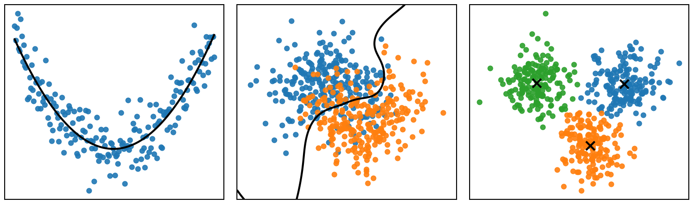

# Introducción

## Machine learning

El **machine learning** o *aprendizaje automático* estudia métodos que permiten utilizar datos para **aprender relaciones, patrones y estructuras** en los datos.

{}

:::{.figure-note}
**Ejemplos de tareas de aprendizaje automático**: ajustar una función, separar observaciones en clases y descubrir grupos en los datos.
:::

## Variables y observaciones

Supongamos que estudiamos $p$ variables:

$$
X = (X_1, X_2, \ldots, X_p)^T.
$$

Cada $X_j$ representa una **variable** o característica medida.

Para una observación $i$, los valores observados de estas variables son:

$$
X_i = (x_{i1}, x_{i2}, \ldots, x_{ip})^T,
\qquad i=1,\ldots,n.
$$

## Conjunto de observaciones

Un conjunto de $n$ observaciones de las $p$ variables, también llamado **conjunto de datos** (*dataset*), puede representarse como

$$
\mathcal D
=
\left\{
x_i
\right\}_{i=1}^{n},
$$

donde cada observación es un vector

$$
x_i
=
(x_{i1},x_{i2},\ldots,x_{ip})^T.
$$

Equivalentemente, podemos organizar las observaciones como las filas de una matriz:

$$
\mathcal D
=
\begin{pmatrix}
x_1^T\\
x_2^T\\
\vdots\\
x_n^T
\end{pmatrix}
=
\begin{pmatrix}
x_{11} & x_{12} & \cdots & x_{1p}\\
x_{21} & x_{22} & \cdots & x_{2p}\\
\vdots & \vdots & \ddots & \vdots\\
x_{n1} & x_{n2} & \cdots & x_{np}
\end{pmatrix}
\in \mathbb{R}^{n\times p}.
$$

Cada **fila** corresponde a una observación y cada **columna** a una variable.

# Tipos de aprendizaje

## Aprendizaje supervisado

En el **aprendizaje supervisado** buscamos aprender la relación entre un vector de variables **predictoras** $X$ y una variable de **respuesta** $Y$:

$$
Y = f(X) + \varepsilon.
$$

Para ello, observamos $n$ pares:

$$
\mathcal D = \left\{(x_i,y_i)\right\}_{i=1}^{n}.
$$

El objetivo es aproximar la función desconocida $f$ para:

- **predecir** la respuesta $Y$ a partir de $X$,
- realizar **inferencia** sobre la relación entre $X$ y $Y$.

## Ejemplo

Supongamos que queremos estudiar el precio de una vivienda a partir de algunas de sus características:

| Superficie (m²) | Habitaciones | Antigüedad (años) | Precio (miles de pesos) |
|---:|---:|---:|---:|
| 80  | 2 | 15 | 1450 |
| 100 | 3 | 10 | 1750 |
| 120 | 3 | 8  | 2100 |
| 150 | 4 | 5  | 2550 |

El vector de **variables predictoras** es

$$
X =
\begin{pmatrix}
X_1\\
X_2\\
X_3
\end{pmatrix}
=
\begin{pmatrix}
\text{Superficie}\\
\text{Habitaciones}\\
\text{Antigüedad}
\end{pmatrix},
$$

mientras que la **variable de respuesta** es

$$
Y = \text{Precio}.
$$

## Ejemplo {.unlisted}

Para cada vivienda observamos una **realización** $(x_i,y_i)$ de estas variables. Por ejemplo,

$$
x_1 =
\begin{pmatrix}
80\\
2\\
15
\end{pmatrix},
\qquad
y_1 = 1450.
$$

El conjunto de datos observado puede representarse como

$$
\mathcal D =
\left(
\begin{array}{ccc|c}
80  & 2 & 15 & 1450\\
100 & 3 & 10 & 1750\\
120 & 3 & 8  & 2100\\
150 & 4 & 5  & 2550
\end{array}
\right)
=
(X_{\text{obs}}\mid\mathbf{y}).
$$

Cada **fila** corresponde a una observación y cada **columna** a una variable.

## Aprendizaje no supervisado

En el **aprendizaje no supervisado** observamos $n$ realizaciones del vector de variables $X$:

$$
\mathcal D = \left\{x_i\right\}_{i=1}^{n},
$$

pero **no existe una variable de respuesta $Y$ conocida**.

Por lo tanto, buscamos descubrir estructura presente en los datos, por ejemplo:

- **relaciones** entre variables,
- **similitudes** entre observaciones,
- **grupos** o patrones presentes en los datos.

## Ejemplo

Supongamos que tenemos información sobre clientes de una tienda:

| Edad | Ingreso mensual | Gasto mensual |
|---:|---:|---:|
| 22 | 12,000 | 3,500 |
| 25 | 15,000 | 4,200 |
| 45 | 38,000 | 8,500 |
| 48 | 42,000 | 9,100 |
| 31 | 24,000 | 5,600 |

El vector de variables es

$$
X
=
\begin{pmatrix}
X_1\\
X_2\\
X_3
\end{pmatrix}
=
\begin{pmatrix}
\text{Edad}\\
\text{Ingreso}\\
\text{Gasto}
\end{pmatrix}.
$$

## Ejemplo {.unlisted}

Por lo tanto, el conjunto de datos es

$$
\mathcal D
=
\begin{pmatrix}
22 & 12000 & 3500\\
25 & 15000 & 4200\\
45 & 38000 & 8500\\
48 & 42000 & 9100\\
31 & 24000 & 5600
\end{pmatrix}.
$$

En este caso **no existe una variable de respuesta $Y$**. A partir de las variables observadas podemos buscar, por ejemplo, grupos de clientes con características similares o relaciones entre las variables.

## Aprendizaje por refuerzo

En el **aprendizaje por refuerzo**, las observaciones

$$
\mathcal D = \left\{x_i\right\}_{i=1}^n
$$

describen el **estado de un entorno** con el que interactúa un agente.

A partir de cada observación $x_i$, el agente selecciona una acción $a_i$ y recibe una recompensa $r_i$:

$$
x_i
\longrightarrow
a_i
\longrightarrow
r_i.
$$

El objetivo es aprender una estrategia o **política** que determine qué acción tomar para maximizar la recompensa acumulada.

A diferencia del aprendizaje supervisado, **no conocemos una respuesta correcta $y_i$**; el agente aprende a partir de las consecuencias de sus acciones.

## Ejemplo

Supongamos que observamos el estado de un vehículo a partir de las siguientes variables:

| Distancia al objetivo (m) | Distancia al obstáculo (m) | Velocidad (m/s) |
|---:|---:|---:|
| 5.2 | 1.3 | 0.8 |
| 4.5 | 0.7 | 0.9 |
| 3.8 | 2.1 | 0.7 |
| 2.4 | 0.3 | 1.0 |
| 1.2 | 1.5 | 0.6 |

El vector de variables que describe el estado del entorno es

$$
X
=
\begin{pmatrix}
X_1\\
X_2\\
X_3
\end{pmatrix}
=
\begin{pmatrix}
\text{Distancia al objetivo}\\
\text{Distancia al obstáculo}\\
\text{Velocidad}
\end{pmatrix}.
$$

## Ejemplo {.unlisted}

En aprendizaje por refuerzo, cada observación $x_i$ representa el **estado del entorno** a partir del cual el agente debe tomar una decisión.

Por ejemplo, podemos definir las acciones disponibles como

$$
a_i \in
\{
\text{avanzar},
\text{girar izquierda},
\text{girar derecha}
\}.
$$

También definimos una recompensa que evalúa las consecuencias de las acciones, por ejemplo:

$$
r_i =
\begin{cases}
+10, & \text{si alcanza el objetivo},\\
-10, & \text{si choca},\\
+1, & \text{si se acerca al objetivo}.
\end{cases}
$$

Así, la interacción puede representarse de forma simplificada como

$$
x_i
\longrightarrow
a_i
\longrightarrow
r_i.
$$

El objetivo es aprender una política que determine qué acción tomar en cada estado para maximizar la recompensa acumulada.

# Aprendizaje supervisado

## Notación

:::{.formula}
A partir de este punto:

- $X = (X_1,\ldots,X_p)^T$ es el vector de **variables predictoras**.
- $Y$ es la **variable de respuesta**.
- $x_i = (x_{i1},\ldots,x_{ip})^T$ es la observación $i$ de las variables predictoras.
- $y_i$ es la observación $i$ de la variable de respuesta.
- $\mathcal D = \{(x_i,y_i)\}_{i=1}^n$ es el **conjunto de datos**.
:::

## Regresión y clasificación

Los problemas supervisados pueden distinguirse según el tipo de respuesta $Y$.

| | **Regresión** | **Clasificación** |
|---|---|---|
| **Tipo de respuesta $Y$** | Cuantitativa | Cualitativa |
| **Valores de $Y$** | Valores numéricos | Categorías o clases |
| **Objetivo** | Estimar un valor | Asignar una clase |
| **Predicción** | $\hat y \in \mathbb R$ | $\hat y \in \{C_1,\ldots,C_K\}$ |
| **Ejemplo de respuesta** | Precio, temperatura, consumo | Positivo/negativo, especie, categoría |
| **Ejemplo de problema** | Predecir el precio de una vivienda | Clasificar un tumor como benigno o maligno |

La distinción depende principalmente de la **variable de respuesta $Y$**, no del tipo de variables predictoras.

## Ejemplo

Supongamos que queremos **predecir el precio de una vivienda** a partir de su tamaño, número de habitaciones y ubicación.

El vector de variables predictoras es

$$
X
=
\begin{pmatrix}
X_1\\
X_2\\
X_3
\end{pmatrix}
=
\begin{pmatrix}
\text{Tamaño}\\
\text{Habitaciones}\\
\text{Ubicación}
\end{pmatrix},
$$

y la variable de respuesta es

$$
Y = \text{Precio}.
$$

Por lo tanto, planteamos el problema como

$$
\text{Precio}
=
f(\text{Tamaño},\text{Habitaciones},\text{Ubicación})
+
\varepsilon.
$$

El objetivo es utilizar datos para **estimar la función desconocida $f$** y utilizarla para predecir el precio de nuevas viviendas.

## De forma general

Sea $X$ el vector de variables predictoras

$$
X = (X_1, X_2, \ldots, X_p)^T,
$$

y $Y$ la variable de respuesta.

La relación entre las variables predictoras y la variable de respuesta se representa como

$$
Y = f(X) + \varepsilon,
$$

donde:

- $f$ representa la **relación entre $X$ y $Y$**.
- $\varepsilon$ representa el **error aleatorio**.

## Estimación de $f$

La función $f$ es **desconocida**. A partir del conjunto de datos

$$
\mathcal D = \{(x_i,y_i)\}_{i=1}^n,
$$

buscamos obtener una **estimación** $\hat f$ de esta relación:

$$
\hat f(X) \approx f(X).
$$

La estimación de $f$ puede tener dos objetivos principales:

- **Predicción:** utilizar $\hat f$ para predecir nuevos valores de $Y$.
- **Inferencia:** utilizar $\hat f$ para comprender la relación entre $X$ y $Y$.

## Predicción

Dados un vector de variables predictoras $X$ y una variable de respuesta $Y$, buscamos una función $\hat f$ tal que

$$
\hat Y = \hat f(X) \quad \text{y} \quad \hat Y \approx Y.
$$

Equivalentemente, 

$$
\left|Y - \hat f(X)\right| \approx 0.
$$

::: {.example}
Predecir el precio de una vivienda a partir de características como los metros cuadrados construidos, número de habitaciones, número de baños y antigüedad.
:::

## Inferencia

Por otro lado, en inferencia buscamos **utilizar** $\hat f$ para comprender la relación entre $X$ y $Y$ y aproximar la forma de $f$:

$$
Y = f(X) + \varepsilon,
\qquad
\hat f \approx f.
$$

En particular, nos interesa entender cómo cada variable $X_j$ se relaciona con $Y$.

::: {.example}
Estudiar cómo los metros cuadrados construidos, el número de habitaciones y la ubicación se relacionan con el precio de una vivienda.

- ¿Qué variables están asociadas con el precio?
- ¿Cómo cambia el precio al cambiar una variable?
- ¿Qué forma tiene la relación entre cada variable y el precio?
:::

## Tipos de métodos

Existen diferentes métodos para estimar la función desconocida $f$. De forma general, podemos distinguir entre:

- **Métodos paramétricos:** suponen cierta estructura para representar $f$.
- **Métodos no paramétricos:** permiten estimar $f$ de una forma más flexible.

## Métodos paramétricos

Los métodos paramétricos suponen una **forma específica para $f$**.

:::{.example}
Podemos asumir una relación lineal entre $X$ y $Y$:

$$
f(X)=\beta_0+\beta_1X_1+\cdots+\beta_pX_p
$$

El problema se reduce entonces a estimar:

$$
\beta_0,\beta_1,\ldots,\beta_p
$$

:::

**Ventaja:** simplifican el problema.

**Desventaja:** si la forma elegida no representa adecuadamente la relación real, el modelo puede ser poco preciso.

## Métodos no paramétricos

Los métodos no paramétricos **no imponen una forma específica para $f$**.

Buscan aproximarse a los datos con mayor flexibilidad.

:::{.example}
Para predecir $Y$ para una nueva observación, $k$-NN busca las observaciones más cercanas y utiliza sus valores para obtener la predicción.
:::

No suponemos previamente que $f$ sea lineal, cuadrática, exponencial, etc.

::: {.text-center}
**La forma de $\hat f$ se adapta a los datos.**
:::

**Ventaja:** pueden representar relaciones más complejas.

**Desventaja:** generalmente requieren más observaciones y pueden ajustarse demasiado a los datos.

## Entrenamiento

Para construir y evaluar un modelo, el conjunto de datos $\mathcal D$ se divide en dos subconjuntos:

- **Conjunto de entrenamiento** (*train*): se utiliza para estimar $\hat f$.
- **Conjunto de evaluación** (*test*): se utiliza para evaluar el desempeño de $\hat f$ sobre datos que no fueron utilizados durante el entrenamiento.

$$
\mathcal D
=
\mathcal D_{\text{train}}
\cup
\mathcal D_{\text{test}},
\qquad
\mathcal D_{\text{train}}
\cap
\mathcal D_{\text{test}}
=
\varnothing.
$$

El objetivo es evaluar qué tan bien el modelo **generaliza a nuevas observaciones**.

## Evaluación

En aprendizaje supervisado conocemos la **respuesta real $Y$**, por lo que podemos compararla con la respuesta predicha $\hat Y$.

Por ejemplo, en regresión podemos medir el error mediante el **error cuadrático medio**:

$$
\text{MSE} = \frac{1}{n}\sum_{i=1}^{n}(y_i-\hat y_i)^2.
$$

Sin embargo, no buscamos únicamente un error pequeño sobre los datos utilizados para entrenar el modelo:

- **Training error:** error sobre los datos de entrenamiento.
- **Test error:** error sobre datos que el modelo no ha visto durante el entrenamiento.

:::{.important}
El objetivo es obtener un **test error bajo**, es decir, que el modelo sea capaz de **generalizar a nuevas observaciones**.
:::

# Resumen

- Machine learning busca **aprender relaciones, patrones o estructuras a partir de datos**.
- En aprendizaje supervisado buscamos estimar la relación

$$
Y = f(X) + \varepsilon.
$$

- La estimación $\hat f$ puede utilizarse con objetivos de **predicción** o **inferencia**.
- Un modelo debe ser capaz de **generalizar a nuevas observaciones**.

# Referencias

::: {#refs}
:::

# Preguntas

:::: {.columns}

::: {.column width="45%"}
{width=95%}
:::

::: {.column width="55%"}
::: {.vcenter}

 ¿Seguro? 🤨 

Bueno...

Pregúntale a [ChatGPT](https://chatgpt.com) pues.

:::
:::

::::

# ¿Qué sigue?

En la siguiente lección comenzaremos a estudiar métodos de **aprendizaje supervisado**.

[**Ir a la lección →**](leccion-08.qmd)