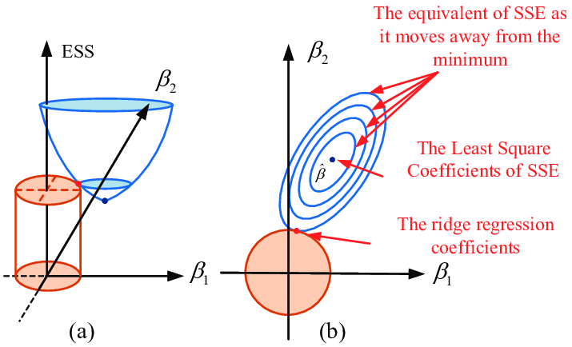
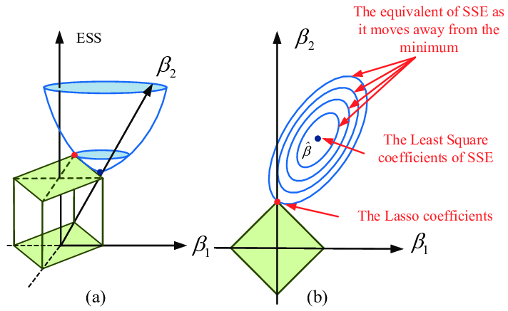

# Regresión regularizada

## Regresión lineal

En regresión lineal estimamos los coeficientes minimizando

$$\boxed{
RSS=\sum_{i=1}^{n}(y_i-\hat y_i)^2
}$$

obteniendo el modelo que mejor se ajusta a los datos de entrenamiento.

Sin embargo, un mejor ajuste no necesariamente implica un mejor desempeño sobre nuevas observaciones.

::: text-center
**¿Podemos controlar la complejidad del modelo durante el ajuste?**
:::

## Regularización

La **regularización** agrega una penalización al criterio de ajuste:

$$\boxed{
RSS
+
\lambda\,P(\boldsymbol{\beta})
}$$

donde:

- $RSS$ mide el error de ajuste;
- $P(\boldsymbol{\beta})$ penaliza la complejidad;
- $\lambda\geq0$ controla la intensidad de la penalización.

Buscamos un equilibrio entre

$$\text{ajuste}
\qquad\longleftrightarrow\qquad
\text{complejidad}.$$

## El parámetro de regularización

El parámetro $\lambda$ determina cuánto penalizamos la complejidad:

$$RSS+\lambda P(\boldsymbol{\beta}).$$

Si $\lambda=0,$ no existe penalización y recuperamos mínimos cuadrados.

Si $\lambda$ aumenta, aumenta la penalización a los coeficientes.

::: formula
Regularizar implica aceptar cierto sacrificio en el ajuste para controlar la complejidad del modelo.
:::

# Regresión Ridge

## Una primera propuesta

Una forma de controlar la complejidad es limitar la magnitud de los coeficientes:

$$\boxed{
\beta_1^2+\beta_2^2+\cdots+\beta_p^2\leq t
}$$

donde $t\geq0$ determina qué tan grandes pueden ser los coeficientes en conjunto.

::: text-center
**¿Qué efecto tiene esta restricción sobre la solución?**
:::

## Interpretación geométrica

Consideremos solamente dos coeficientes:

$$\beta_1,\qquad\beta_2.$$

La restricción Ridge es

$$\boxed{
\beta_1^2+\beta_2^2\leq t
}$$

que representa un disco de radio $\sqrt{t}$.

Por lo tanto, la solución debe encontrarse dentro de la región permitida.

## Interpretación geométrica {.unlisted}



## Interpretación geométrica {.unlisted}

Las curvas de nivel representan combinaciones de

$$(\beta_1,\beta_2)$$

que producen el mismo valor de $RSS$.

El centro corresponde a la solución de mínimos cuadrados:

$$\hat{\boldsymbol{\beta}}_{OLS}.$$

La solución Ridge será el punto dentro de la región permitida que produzca el menor $RSS$ posible.

## Shrinkage

La restricción impide que los coeficientes tomen valores arbitrariamente grandes.

Como resultado, la solución Ridge es desplazada hacia el origen:

$$\hat{\boldsymbol{\beta}}_{Ridge}
\longrightarrow
\mathbf 0.$$

Este efecto se conoce como **shrinkage** o contracción.

::: formula
Ridge sacrifica parte del ajuste para obtener coeficientes de menor magnitud.
:::

## Formulación matemática

La regresión Ridge estima los coeficientes minimizando

$$\boxed{
RSS
+
\lambda
\sum_{j=1}^{p}\beta_j^2
}$$

La penalización

$$\sum_{j=1}^{p}\beta_j^2$$

favorece soluciones con coeficientes de menor magnitud.

El intercepto $\beta_0$ **no se penaliza**.

## Dos formas de Ridge

Podemos expresar Ridge mediante una penalización:

$$\boxed{
\min
\left[
RSS+\lambda\sum_{j=1}^{p}\beta_j^2
\right]
}$$

o mediante una restricción:

$$\boxed{
\min RSS
\qquad
\text{sujeto a}
\qquad
\sum_{j=1}^{p}\beta_j^2\leq t.
}$$

Ambas formulaciones representan el mismo principio:

$$\text{controlar la magnitud de los coeficientes}.$$

## Solución Ridge

En forma matricial,

$$RSS
=
\|\mathbf y-X\boldsymbol{\beta}\|_2^2.$$

Por lo tanto, Ridge minimiza

$$\|\mathbf y-X\boldsymbol{\beta}\|_2^2
+
\lambda\|\boldsymbol{\beta}\|_2^2.$$

Derivando e igualando a cero:

$$-2X^\top(\mathbf y-X\boldsymbol{\beta})
+
2\lambda\boldsymbol{\beta}
=
0.$$


## Solución Ridge {.unlisted}

Entonces,

$$(X^\top X+\lambda I)\boldsymbol{\beta}
=
X^\top\mathbf y.$$

Por lo tanto,

$$\boxed{
\hat{\boldsymbol{\beta}}_{Ridge}
=
(X^\top X+\lambda I)^{-1}X^\top\mathbf y
}$$

## Ridge vs. mínimos cuadrados

En mínimos cuadrados,

$$\hat{\boldsymbol{\beta}}_{OLS}
=
(X^\top X)^{-1}X^\top\mathbf y.$$

En Ridge,

$$\hat{\boldsymbol{\beta}}_{Ridge}
=
(X^\top X+\lambda I)^{-1}X^\top\mathbf y.$$

La diferencia está en

$$\boxed{
X^\top X
\quad\longrightarrow\quad
X^\top X+\lambda I
}$$

Cuando $\lambda=0$, recuperamos la solución de mínimos cuadrados.

## Efecto de $\lambda$

El parámetro $\lambda$ controla la intensidad de *contracción*:

$$\lambda=0
\qquad\Longrightarrow\qquad
\hat{\boldsymbol{\beta}}_{Ridge}
=
\hat{\boldsymbol{\beta}}_{OLS}.$$

A medida que $\lambda$ aumenta,

$$\lambda\uparrow
\qquad\Longrightarrow\qquad
\|\hat{\boldsymbol{\beta}}_{Ridge}\|_2\downarrow.$$

En el límite,

$$\lambda\rightarrow\infty
\qquad\Longrightarrow\qquad
\hat{\boldsymbol{\beta}}_{Ridge}\rightarrow\mathbf 0.$$

::: formula
Ridge reduce progresivamente la magnitud de los coeficientes, pero generalmente **no los hace exactamente cero**.
:::

# Regresión Lasso

## Una segunda propuesta

En lugar de restringir la suma de los cuadrados, podemos restringir la suma de las magnitudes:

$$\boxed{
|\beta_1|+|\beta_2|+\cdots+|\beta_p|\leq t
}$$

donde $t\geq0$ controla la magnitud permitida de los coeficientes.

## Interpretación geométrica

Para dos coeficientes,

$$|\beta_1|+|\beta_2|\leq t,$$

la región permitida tiene forma de **diamante**.

::: text-center
**¿Qué diferencia produce esta geometría?**
:::

## Interpretación geométrica {.unlisted}



## Shrinkage y sparsity

Lasso también contrae los coeficientes hacia cero:

$$\hat{\boldsymbol{\beta}}_{Lasso}
\longrightarrow
\mathbf 0.$$

Sin embargo, algunos coeficientes pueden llegar a ser **exactamente cero**:

$$\boxed{
\hat\beta_j=0.
}$$

Cuando esto ocurre, el predictor $X_j$ deja de contribuir al modelo.

::: formula
Lasso produce modelos **sparse**: modelos en los que solo una parte de los predictores tiene coeficientes distintos de cero.
:::

## Formulación matemática

La regresión Lasso estima los coeficientes minimizando

$$\boxed{
RSS
+
\lambda
\sum_{j=1}^{p}|\beta_j|
}$$

La penalización

$$\sum_{j=1}^{p}|\beta_j|$$

se conoce como penalización $L_1$. El intercepto $\beta_0$ **no se penaliza**.

## Ridge vs. Lasso

**Ridge**

$$RSS+\lambda\sum_{j=1}^{p}\beta_j^2$$

contrae los coeficientes hacia cero, pero generalmente $\hat\beta_j\neq0.$

**Lasso**

$$RSS+\lambda\sum_{j=1}^{p}|\beta_j|$$

puede producir $\hat\beta_j=0$.

::: formula
Ambos métodos regularizan el modelo, pero Lasso además puede eliminar efectivamente algunos predictores.
:::

## ¿Cómo se resuelve Lasso?

A diferencia de Ridge, la función $|\beta_j|$ no es diferenciable en $\beta_j=0.$

Por esta razón, Lasso no tiene una solución cerrada simple como

$$(X^\top X+\lambda I)^{-1}X^\top y.$$

En la práctica, los coeficientes se obtienen mediante métodos de optimización iterativos.

::: formula
Lasso se resuelve numéricamente, actualizando los coeficientes hasta encontrar la solución que minimiza el criterio penalizado.
:::

# Validación cruzada

## ¿Cómo elegimos $\lambda$?

Podemos probar diferentes valores:

$$\lambda_1,\lambda_2,\ldots,\lambda_m.$$

Pero necesitamos decidir cuál produce el mejor desempeño sobre **datos no utilizados para ajustar el modelo**.

Una primera estrategia consiste en dividir los datos en:

$$\boxed{
\text{entrenamiento}
\quad+\quad
\text{validación}
}$$

- **Entrenamiento:** estimamos los coeficientes.
- **Validación:** evaluamos diferentes valores de $\lambda$.

Seleccionamos el valor con menor error de validación.

## ¿Y si la división cambia?

El resultado puede depender de qué observaciones quedaron en entrenamiento y cuáles en validación.

Una sola división puede producir una estimación inestable del desempeño.

::: text-center
**¿Podemos utilizar los datos de manera más eficiente?**
:::

## $K$-fold cross-validation

Dividimos el conjunto de datos en $K$ bloques:

$$D=D_1\cup D_2\cup\cdots\cup D_K, \quad \text{con} \quad D_i\cap D_j=\emptyset \quad \text{para todo} \quad i\ne j.$$

En cada iteración:

1.  utilizamos $K-1$ bloques para entrenar;
2.  utilizamos el bloque restante para validar;
3.  calculamos el error de validación.

Cada bloque se utiliza **una vez para validación** y $K-1$ veces para entrenamiento.

## Selección de $\lambda$ mediante CV

```{text}
para cada bloque Dᵢ:

    entrenamiento ← D - Dᵢ
    validación    ← Dᵢ

    para cada λⱼ:

        ajustar modelo usando entrenamiento y λⱼ
        evaluar modelo en validación
        guardar error Eᵢⱼ

para cada λⱼ:

    CV(λⱼ) ← promedio de E₁ⱼ, ..., Eₖⱼ

seleccionar λ* con el menor CV(λⱼ)
```

## Ajuste del modelo final

Una vez seleccionado el hiperparámetro $\lambda^*$, lo consideramos **fijo** y utilizamos todos los datos de entrenamiento para estimar los coeficientes:

$$\boxed{
\hat{\boldsymbol{\beta}}
=
\underset{\boldsymbol{\beta}}{\operatorname{argmin}}
\left[
RSS
+
\lambda^*P(\boldsymbol{\beta})
\right]
}$$

Por lo tanto, tenemos dos tareas diferentes:

$$\boxed{
\text{seleccionar }\lambda
\quad\longrightarrow\quad
\text{estimar }\boldsymbol{\beta}
}$$

- $\lambda$: **hiperparámetro**, seleccionado mediante validación cruzada.
- $\boldsymbol{\beta}$: **parámetros**, estimados durante el ajuste del modelo.

## Estandarización de los predictores

Ridge y Lasso penalizan directamente la magnitud de los coeficientes:

$$\sum_{j=1}^{p}\beta_j^2
\qquad\text{o}\qquad
\sum_{j=1}^{p}|\beta_j|.$$

Por lo tanto, la penalización depende de la **escala de los predictores**.

## Estandarización de los predictores {.unlisted}

Antes de ajustar el modelo, normalmente estandarizamos:

$$\boxed{
Z_j
=
\frac{X_j-\bar X_j}{s_j}
}$$

de modo que cada predictor tenga

$$\text{media}=0,
\qquad
\text{desviación estándar}=1.$$

::: formula
La estandarización permite que la penalización actúe de manera comparable sobre todos los coeficientes.
:::

# Inferencia

## ¿Qué ocurre con la inferencia?

En regresión lineal clásica utilizamos los coeficientes estimados para realizar inferencia mediante:

$$SE(\hat\beta_j),\qquad
CI,\qquad
p\text{-values}.$$

En Ridge y Lasso, los coeficientes son estimados bajo una penalización:

$$RSS+\lambda P(\boldsymbol{\beta}).$$

Como consecuencia, los estimadores son **sesgados** y la inferencia clásica de mínimos cuadrados no puede aplicarse directamente.

## ¿Qué ocurre con la inferencia? {.unlisted}

::: formula
Ridge y Lasso se utilizan principalmente para mejorar la **predicción y estabilidad del modelo**, no para realizar inferencia clásica sobre los coeficientes.
:::

Existen métodos específicos para realizar inferencia en modelos regularizados, como **bootstrap** y **inferencia post-selección**.


# Referencias

::: {#refs}
:::

# Preguntas

::::::::: columns
::: {.column width="45%"}
{width="95%"}
:::

::::::: {.column width="55%"}
:::::: vcenter
::: fragment
¿Seguro? 🤨
:::

::: fragment
Bueno...
:::

::: fragment
Pregúntale a [ChatGPT](https://chatgpt.com) pues.
:::
::::::
:::::::
:::::::::

# ¿Qué sigue?

En el siguiente notebook aplicaremos regresión Ridge y Lasso en Python y analizaremos el efecto de la regularización sobre los coeficientes del modelo y su capacidad de generalización.

[**Ir a la notebook →**](https://colab.research.google.com/github/urendacdenisse-hub/modelado-de-datos/blob/main/notebooks/unidad-01/notebook-05.ipynb)