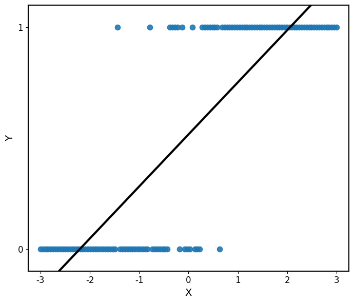
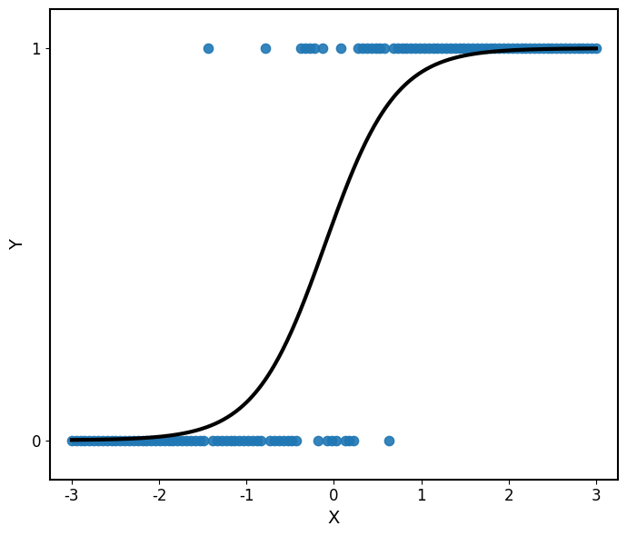
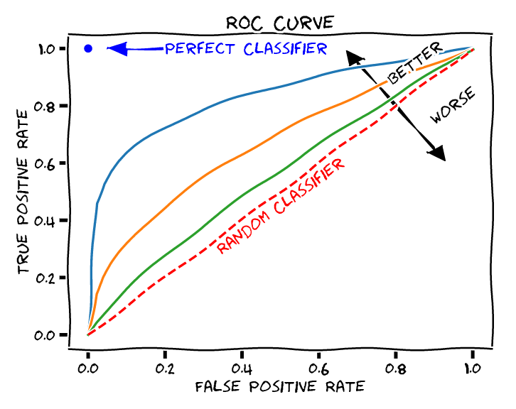

## Introducción

En muchos problemas de aprendizaje supervisado, la variable respuesta no es cuantitativa sino **cualitativa**.

Por ejemplo:

- ¿Un cliente comprará un producto?
- ¿Un paciente presenta una enfermedad?
- ¿Un correo es spam?
- ¿Un estudiante aprobará el curso?

En el caso más sencillo tenemos dos posibles resultados:

$$Y\in\{0,1\}.$$

Nuestro objetivo será modelar la probabilidad de que ocurra uno de ellos.

## Formulación del problema

Supongamos que observamos una variable predictora $X$ y una variable respuesta binaria $Y\in\{0,1\}.$

Queremos modelar

$$P(Y=1\mid X=x).$$

Definimos

$$p(x)=P(Y=1\mid X=x).$$

Por lo tanto,

$$P(Y=0\mid X=x)=1-p(x).$$

::: formula
La regresión logística busca construir una función

$$p(x)=f(x), \quad \text{tal que} \quad 0\leq p(x)\leq 1.$$
:::

## ¿Por qué no usar regresión lineal?

::::: columns
::: {.column width="55%"}
Podríamos intentar modelar

$$p(x)=\beta_0+\beta_1x.$$

Sin embargo, una función lineal puede producir valores menores que $0$ o mayores que $1$.

Por ejemplo,

$$\beta_0+\beta_1x=1.4$$

no puede interpretarse como una probabilidad.
:::

::: {.column width="45%"}
{width="100%"}
:::
:::::

::: formula
Necesitamos una función que transforme cualquier valor real en un número entre $0$ y $1$.
:::

## Intuición geométrica

::::: columns
::: {.column width="55%"}
La regresión logística modela primero una combinación lineal

$$z=\beta_0+\beta_1x.$$

Pero en lugar de utilizar $z$ directamente como predicción, lo transforma mediante la **función logística**:

$$p(x)=\frac{1}{1+e^{-z}}.$$
:::

::: {.column width="45%"}
{width="100%"}
:::
:::::

La función logística transforma cualquier número real en un valor entre $0$ y $1$, es decir, $\sigma:\mathbb{R}\rightarrow(0,1)$.

::: formula
Por lo tanto, modelamos la probabilidad de $Y=1$ como
$$p(x) = P(Y=0\mid X=x) =\frac{1}{1+e^{-(\beta_0+\beta_1x)}}.$$

:::

## Derivación simple

Queremos relacionar una probabilidad $p \in (0,1)$ con una expresión lineal que pueda tomar cualquier valor en $\mathbb R$. Es decir, una función
$$\sigma:(0,1) \rightarrow \mathbb R$$

### Primer intento

Comenzamos con la razón conocida como **odds**:
$$\frac{p}{1-p}.$$

Si $p\in(0,1)$ entonces

$$\frac{p}{1-p}\in(0,\infty).$$

## Odds

Los odds comparan la probabilidad de que ocurra un evento con la probabilidad de que no ocurra:

$$\text{odds}=\frac{p}{1-p}.$$

Por ejemplo, si $p=0.8$, entonces

$$\text{odds}=\frac{0.8}{0.2}=4.$$

Esto significa que el evento es **4 veces más probable que ocurra a que no ocurra**.

## Log-odds

Los odds todavía están restringidos a valores positivos.

Aplicamos logaritmo:

$$\log\left(\frac{p}{1-p}\right).$$

Esta transformación puede tomar cualquier valor real:

$$-\infty<\log\left(\frac{p}{1-p}\right)<\infty.$$

Esta cantidad se conoce como **logit** o **log-odds**.

## Modelo logístico

Ahora podemos modelar los log-odds mediante una función lineal:

$$
\log\left(
\frac{p(x)}{1-p(x)}
\right)
=
\beta_0+\beta_1x.
$$

Resolviendo para $p(x)$ obtenemos

$$p(x)=\frac{1}{1+e^{-(\beta_0+\beta_1x)}}.$$

que es el modelo de **regresión logística**.

## ¿Qué estamos modelando realmente?

La relación entre $X$ y la probabilidad no es lineal:

$$
p(x)
=
\frac{1}
{1+e^{-(\beta_0+\beta_1x)}}.
$$

Lo que sí es lineal es

$$
\boxed{
\log\left(
\frac{p(x)}{1-p(x)}
\right)
=
\beta_0+\beta_1x
}
$$

Es decir, la regresión logística es lineal en los **log-odds**.

## Ejemplo simple

::: example
Se quiere modelar la probabilidad de aprobar un examen según las **horas de estudio**.Sea

$$
Y=
\begin{cases}
1, & \text{aprueba},\\
0, & \text{no aprueba}.
\end{cases}
$$

Se ajusta el modelo de regresión logística y se obtiene $\beta_0 = -4,\quad \beta_1 = 1$.

- ¿Cuál es la probabilidad de aprobar si un estudiante estudia 3 horas? ¿Y si estudia 5 horas?
- ¿Cómo podemos convertir estas probabilidades en una decisión: aprueba o no aprueba?
- ¿A partir de cuántas horas de estudio el modelo clasifica a un estudiante como aprobado?
:::

## De probabilidades a clases

La regresión logística estima

$$p(x)=P(Y=1\mid X=x).$$

Para obtener una clase debemos elegir un **umbral de decisión** $c$:

$$\hat y=
\begin{cases}
1, & p(x)\geq c,\\
0, & p(x)<c.
\end{cases}
$$

El valor $c=0.5$ es una elección común, pero **no necesariamente es la mejor**.

::: formula
La elección del umbral depende del problema y del costo de cometer diferentes tipos de error.
:::

La **frontera de decisión** corresponde a los valores de $x$ donde

$$p(x)=c.$$

## Extensión al caso general

Sea $Y\in\{0,1\}$ una variable respuesta binaria y sean

$$X_1,X_2,\ldots,X_p$$

las $p$ variables predictoras.

Queremos modelar la probabilidad condicional

$$
p(x_1,\ldots,x_p)
=
P(Y=1\mid X_1=x_1,\ldots,X_p=x_p).
$$

La regresión logística supone que los **log-odds** de esta probabilidad son una función lineal de los predictores:

::: formula

$$
\log\left(
\frac{p(x_1,\ldots,x_p)}
{1-p(x_1,\ldots,x_p)}
\right)
=
\beta_0+\beta_1x_1+\cdots+\beta_px_p.
$$
:::

## Notación matricial

Para incluir el intercepto, definimos

$$
\mathbf x
=
(1,x_1,\ldots,x_p)^T,
\qquad
\boldsymbol\beta
=
(\beta_0,\beta_1,\ldots,\beta_p)^T.
$$

Entonces,

$$
\beta_0+\beta_1x_1+\cdots+\beta_px_p
=
\mathbf x^T\boldsymbol\beta.
$$

Por lo tanto, el modelo puede escribirse como

$$
\log\left(
\frac{p(\mathbf x)}
{1-p(\mathbf x)}
\right)
=
\mathbf x^T\boldsymbol\beta.
$$

Despejando $p(\mathbf x)$,

$$
p(\mathbf x)
=
\frac{e^{\mathbf x^T\boldsymbol\beta}}
{1+e^{\mathbf x^T\boldsymbol\beta}}.
$$

## Modelo multivariado

::: formula
**Modelo de regresión logística**

Sea $Y\in\{0,1\}$ una variable respuesta binaria y sean

$$
\mathbf x=(1,x_1,\ldots,x_p)^T,
\qquad
\boldsymbol\beta=(\beta_0,\beta_1,\ldots,\beta_p)^T,
$$

el vector de predictores y el vector de parámetros, respectivamente.

La probabilidad condicional de $Y=1$ está dada por

$$
\boxed{
p(\mathbf x)
=
P(Y=1\mid \mathbf x)
=
\frac{1}
{1+e^{-\mathbf x^T\boldsymbol\beta}}
}.
$$
:::

## ¿Cómo estimamos los coeficientes?

Recordemos que en regresión lineal estimamos

$$
\hat{\boldsymbol\beta}
=
\underset{\boldsymbol\beta}{\arg\min}\;
\text{RSS}(\boldsymbol\beta)
=
\underset{\boldsymbol\beta}{\arg\min}\;
(\mathbf y-\mathbf X\boldsymbol\beta)^T
(\mathbf y-\mathbf X\boldsymbol\beta).
$$

Podríamos plantear un criterio similar para regresión logística:

$$
\underset{\boldsymbol\beta}{\arg\min}
\sum_{i=1}^n
\left(y_i-p_i\right)^2, \qquad p_i=P(Y_i=1\mid \mathbf x_i).
$$

Sin embargo, ahora sabemos que nuestra variable respuesta sigue una distribución

$$Y_i\mid\mathbf x_i\sim\operatorname{Bernoulli}(p_i).$$

::: formula
En lugar de minimizar errores cuadrados, utilizaremos la **distribución de** $Y_i$ para estimar los parámetros del modelo.
:::

## Utilizando la distribución de $Y$

Sabemos que

$$
Y_i\mid\mathbf x_i
\sim
\operatorname{Bernoulli}(p_i).
$$

Por lo tanto,

$$
P(Y_i=y_i\mid\mathbf x_i)
=
\begin{cases}
p_i, & y_i=1,\\
1-p_i, & y_i=0.
\end{cases}
$$

Esto puede escribirse de forma compacta como

$$
P(Y_i=y_i\mid\mathbf x_i)
=
p_i^{y_i}(1-p_i)^{1-y_i}.
$$

::: {.formula}
Esta expresión nos dice qué tan probable es observar $y_i$ para un valor dado de $p_i$.
:::

## Función de verosimilitud

Para cada observación tenemos

$$
P(Y_i=y_i\mid\mathbf x_i)
=
p_i^{y_i}(1-p_i)^{1-y_i}.
$$

Si suponemos que las observaciones son independientes, la probabilidad conjunta de observar

$$y_1,y_2,\ldots,y_n$$

es el producto de las probabilidades individuales:

$$
L(\boldsymbol\beta)
=
\prod_{i=1}^{n}
p_i^{y_i}(1-p_i)^{1-y_i}.
$$

::: {.formula}
La **función de verosimilitud** mide qué tan compatibles son los parámetros $\boldsymbol\beta$ con los datos observados.
:::

## Máxima verosimilitud

Queremos encontrar los valores de $\boldsymbol\beta$ que hagan **más probable observar los datos que obtuvimos**.

Por lo tanto,

$$
\hat{\boldsymbol\beta}
=
\underset{\boldsymbol\beta}{\arg\max}
\;L(\boldsymbol\beta).
$$

Como

$$
L(\boldsymbol\beta)
=
\prod_{i=1}^{n}
p_i^{y_i}(1-p_i)^{1-y_i},
$$

maximizar la verosimilitud significa encontrar los coeficientes que asignen probabilidades altas a los resultados observados.

:::: {.formula }
::: text-center
Los coeficientes de la regresión logística se estiman mediante **máxima verosimilitud**.
:::
::::

## Log-verosimilitud

Queremos maximizar la función de verosimilitud

$$
L(\boldsymbol\beta)
=
\prod_{i=1}^{n}
p_i^{y_i}(1-p_i)^{1-y_i}.
$$

Sin embargo, esta expresión contiene un producto. Como la función logarítmica transforma productos en sumas y además es estrictamente creciente, definimos $\ell(\boldsymbol\beta) = \log L(\boldsymbol\beta).$

Entonces,

$$
\underset{\boldsymbol\beta}{\arg\max}\;L(\boldsymbol\beta)
=
\underset{\boldsymbol\beta}{\arg\max}\;\ell(\boldsymbol\beta).
$$

::: {.formula}
**Estimación por máxima verosimilitud**

$$
\hat{\boldsymbol\beta}
=
\underset{\boldsymbol\beta}{\arg\max}\;
\left[\sum_{i=1}^{n}
\left[
y_i\log(p_i)
+
(1-y_i)\log(1-p_i)
\right]\right].
$$
:::

## Una diferencia importante

En regresión lineal obtuvimos una solución cerrada:

$$
\hat{\boldsymbol\beta}
=
(\mathbf X^T\mathbf X)^{-1}
\mathbf X^T\mathbf y.
$$

En regresión logística, en general, no existe una solución cerrada equivalente para

$$
\hat{\boldsymbol\beta}
=
\underset{\boldsymbol\beta}{\arg\max}\;
\ell(\boldsymbol\beta).
$$

Por lo tanto, los coeficientes se obtienen mediante **optimización numérica**.

::: example
**Newton-Raphson** es un método iterativo que, aplicado a la maximización de la log-verosimilitud, produce la actualización

$$
\boldsymbol\beta^{(t+1)}
=
\boldsymbol\beta^{(t)}
-
\left[
\nabla^2\ell(\boldsymbol\beta^{(t)})
\right]^{-1}
\nabla\ell(\boldsymbol\beta^{(t)}).
$$
:::

## Predicción y clasificación

Una vez estimados los parámetros, para una nueva observación $\mathbf x_*$ calculamos

$$
\hat p
=
\frac{1}
{1+e^{-\mathbf x_*^T\hat{\boldsymbol\beta}}}.
$$

Esta es una **predicción probabilística**.

Para obtener una clase, elegimos un umbral $c$:

$$
\hat y
=
\begin{cases}
1, & \hat p\geq c,\\
0, & \hat p<c.
\end{cases}
$$

::: note
Un valor común es $c=0.5$, pero el umbral depende del problema.
:::

## Interpretación de los coeficientes

Recordemos que

$$
\log\left(\frac{p}{1-p}\right)
=
\beta_0+\beta_1x_1+\cdots+\beta_px_p.
$$

Manteniendo las demás variables constantes, aumentar $x_j$ una unidad cambia los **log-odds** en

$$\beta_j.$$

Equivalentemente, los odds se multiplican por $e^{\beta_j}$. Esta cantidad se conoce como **odds ratio**.

:::{.example}
Si $\beta_i=2$, los odds se multiplican por $e^2\approx7.39$.
:::

## Inferencia sobre los coeficientes

Para muestras suficientemente grandes,

$$
\hat\beta_j
\approx
\mathcal N\left(
\beta_j,
\operatorname{SE}(\hat\beta_j)^2
\right).
$$

Esto permite construir **intervalos de confianza** y realizar pruebas de hipótesis, por ejemplo,

$$
H_0:\beta_j=0
\qquad\text{vs.}\qquad
H_1:\beta_j\neq0.
$$

Una prueba común utiliza el estadístico de Wald:

$$
z=
\frac{\hat\beta_j}
{\operatorname{SE}(\hat\beta_j)}.
$$

## Métricas de clasificación

Después de seleccionar un umbral, comparamos $y_i$ con $\hat y_i$:

|          | Predicción $1$ | Predicción $0$ |
|----------|---------------:|---------------:|
| Real $1$ |             TP |             FN |
| Real $0$ |             FP |             TN |

A partir de la **matriz de confusión** podemos definir distintas métricas de desempeño.

## Métricas de clasificación {.unlisted}

$$
\operatorname{Accuracy}
=
\frac{TP+TN}{TP+TN+FP+FN}
$$

$$\operatorname{Precision}
=
\frac{TP}{TP+FP},
\qquad
\operatorname{Recall}
=
\frac{TP}{TP+FN}.
$$

- **Accuracy:** ¿qué proporción clasificamos correctamente?
- **Precision:** de los positivos predichos, ¿cuántos eran positivos?
- **Recall:** de los positivos reales, ¿cuántos detectamos?

::: formula
La métrica depende del tipo de error que queremos evitar:

- Si es importante evitar **falsos positivos (FP)**, buscamos mayor **Precision**.
- Si es importante evitar **falsos negativos (FN)**, buscamos mayor **Recall**.
:::

## Selección del umbral

En un problema de clasificación, debemos elegir un umbral $c$ para convertir las probabilidades en clases:

$$
\hat{Y} =
\begin{cases}
1, & \hat{p} \geq c,\\
0, & \hat{p} < c.
\end{cases}
$$

Diferentes valores de $c$ producen diferentes **falsos positivos** y **verdaderos positivos**.

Una herramienta para analizar y seleccionar el umbral es la **curva ROC**.

La curva ROC permite comparar el comportamiento del clasificador para distintos valores de $c$.

## Construcción de la curva ROC

Para cada valor del umbral $c$ calculamos:

$$
\operatorname{TPR}
=
\frac{TP}{TP+FN},
\quad
\operatorname{FPR}
=
\frac{FP}{FP+TN}
$$

:::: {.columns}

::: {.column width="40%"}

Cada umbral $c$ genera un punto:

$$
(\operatorname{FPR},\operatorname{TPR})
$$

La **curva ROC** se obtiene al representar estos puntos para distintos valores de $c$.

:::

::: {.column width="60%"}

:::

::::

## Evaluación probabilística

Las métricas anteriores evalúan las **clases predichas**. También podemos evaluar directamente las probabilidades $\hat p_i$.

La **log-loss** está dada por

$$-\frac1n
\sum_{i=1}^{n}
\left[
y_i\log(\hat p_i)
+
(1-y_i)\log(1-\hat p_i)
\right].$$

::: formula
La log-loss corresponde a la **log-verosimilitud negativa promedio**.

Una menor log-loss indica mejores predicciones probabilísticas.
:::

## Supuestos y limitaciones

Para aplicar regresión logística debemos considerar que:

- las observaciones son **independientes**;

- los **log-odds** se modelan como una función lineal de los predictores;

- los predictores no presentan **multicolinealidad severa**.

::: formula

La regresión logística **no requiere normalidad de los predictores** ni una relación lineal entre los predictores y la probabilidad.

:::

## Referencias

::: {#refs}
:::

## Preguntas

::::::::: columns
::: {.column width="45%"}
{width="95%"}
:::

::::::: {.column width="55%"}
:::::: vcenter
::: fragment
¿Seguro? 🤨
:::

::: fragment
Bueno...
:::

::: fragment
Pregúntale a [ChatGPT](https://chatgpt.com) pues.
:::
::::::
:::::::
:::::::::

## ¿Qué sigue?

En el siguiente notebook implementaremos un modelo de **regresión logística**, desde la preparación de los datos hasta la evaluación del clasificador y la selección del umbral de decisión.

[**Ir al notebook →**](https://colab.research.google.com/github/urendacdenisse-hub/modelado-de-datos/blob/main/notebooks/unidad-01/notebook-06.ipynb)