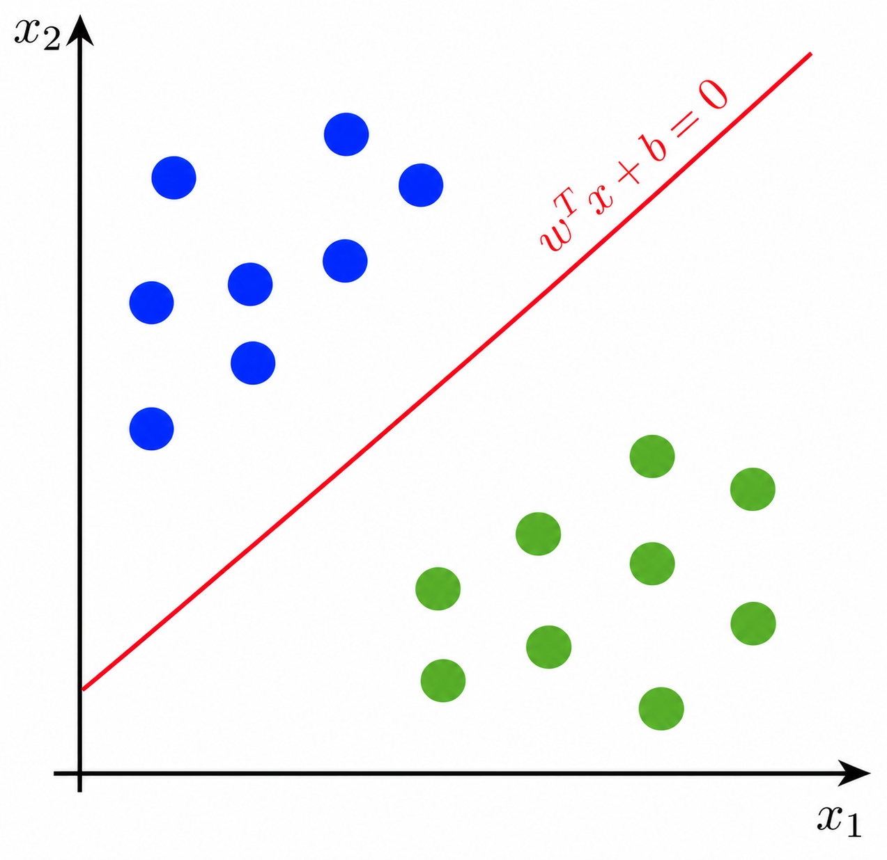
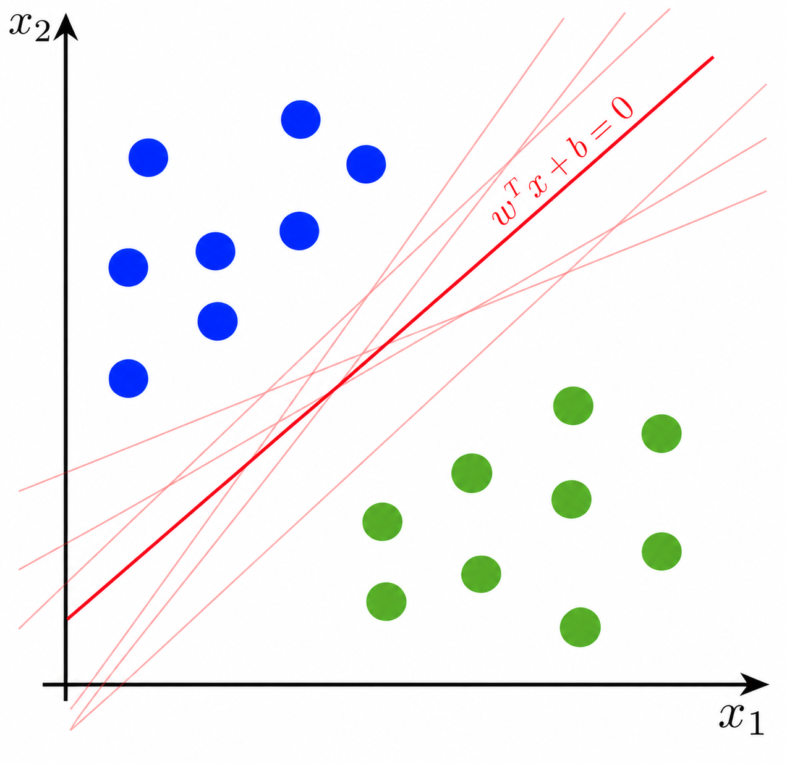
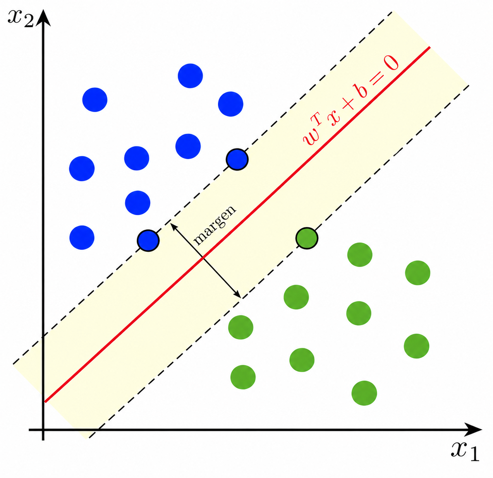
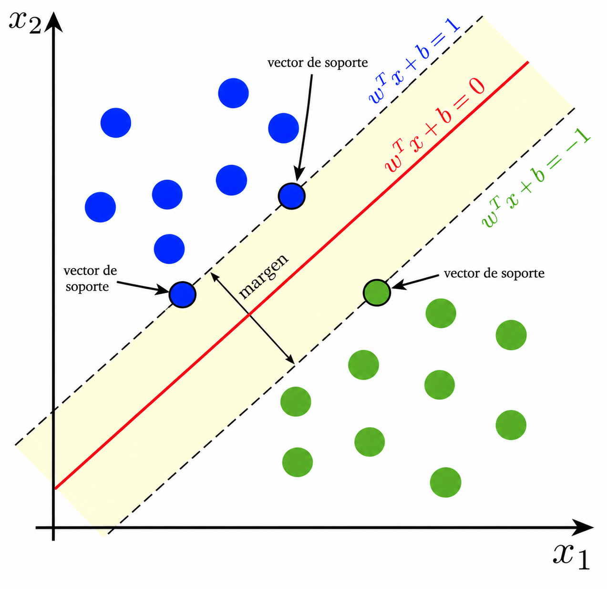
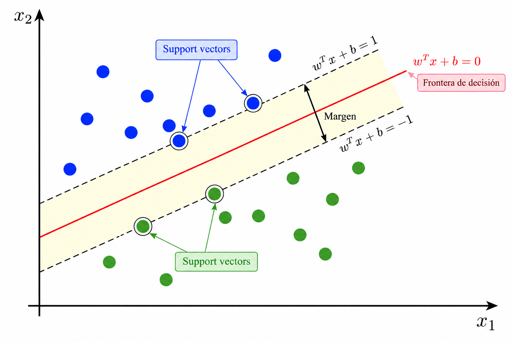
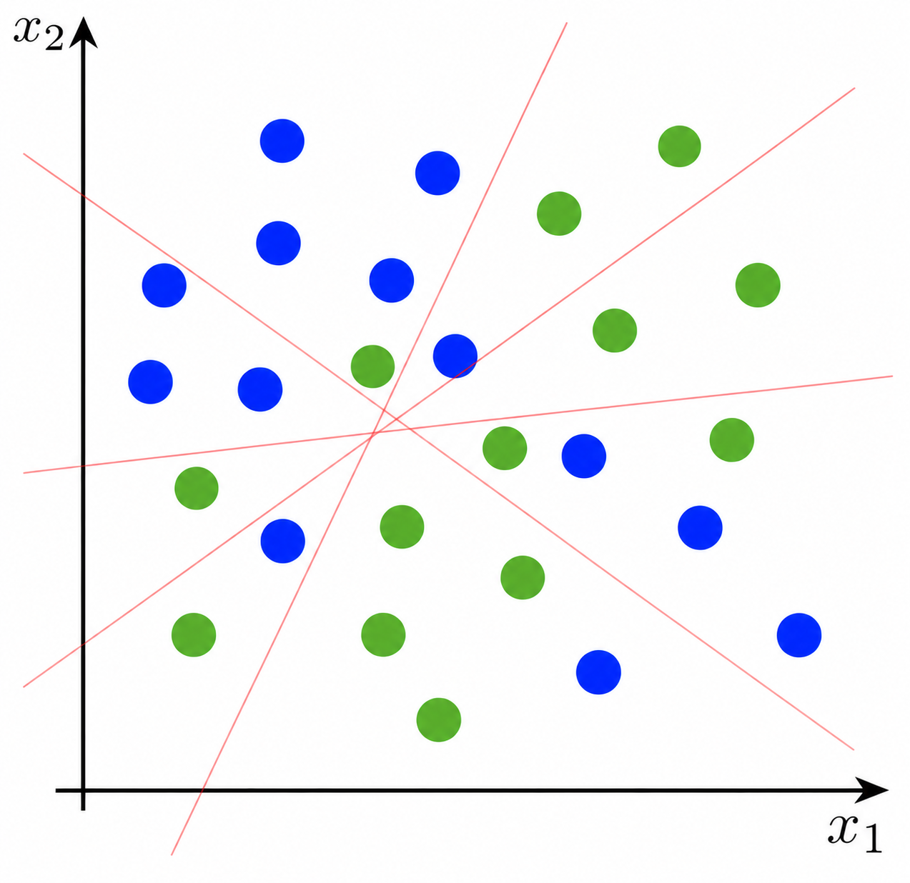
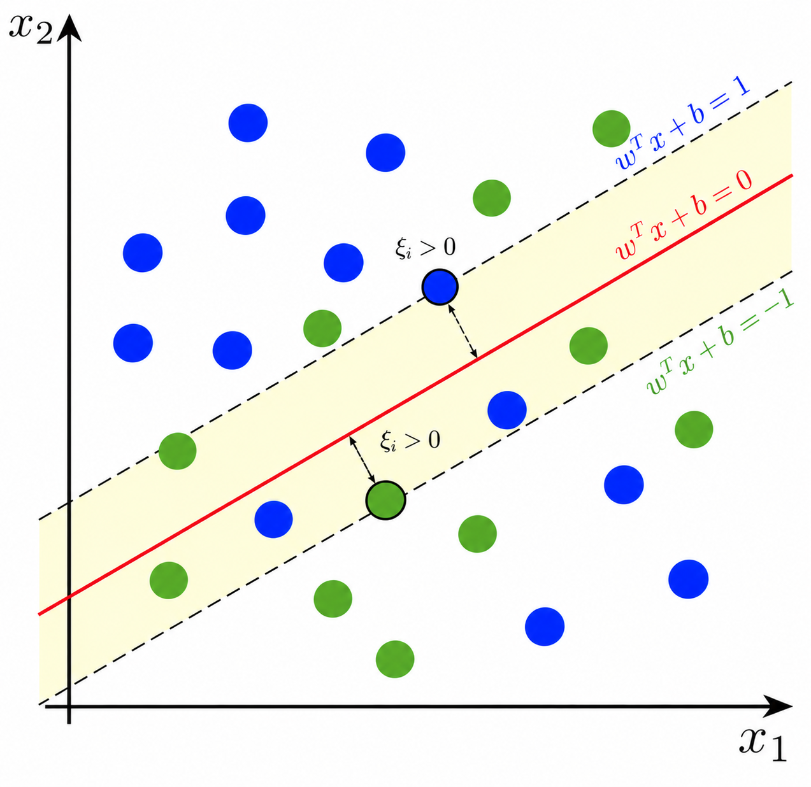
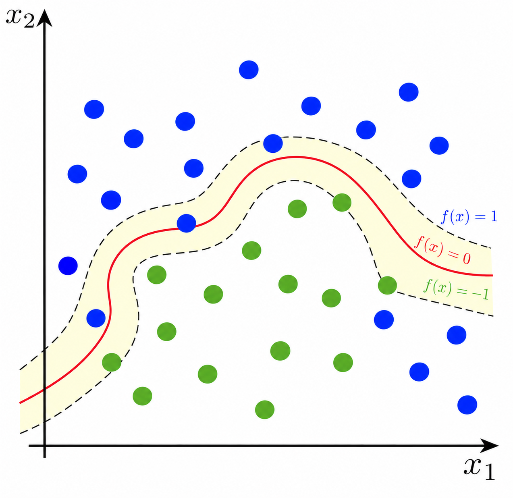

## Introducción

:::: {.columns}

::: {.column width="55%"}

Supongamos que tenemos un problema de clasificación con dos clases.

Nuestro objetivo es construir una **frontera de decisión** que permita separar las observaciones.

En dos dimensiones, una frontera lineal puede escribirse como

$$
w_1x_1+w_2x_2+b=0.
$$

En general,

$$
\mathbf w^T\mathbf{x}+b=0,
\qquad
\mathbf w\in\mathbb R^p.
$$

:::

::: {.column width="45%"}

{width="100%"}

:::

::::

::: formula
En **Support Vector Machine (SVM)** se busca construir una frontera que separe las clases con el **mayor margen posible**.
:::

## ¿Qué frontera elegimos?

:::: {.columns}

::: {.column width="50%"}

Si los datos son linealmente separables, pueden existir muchas fronteras capaces de clasificarlos correctamente.

Todas pueden separar las clases.

Entonces surge una pregunta:

**¿cuál deberíamos elegir?**

:::

::: {.column width="50%"}

{width="100%"}

:::

::::

## Margen máximo

:::: {.columns}

::: {.column width="50%"}

SVM elige la frontera que se encuentre **lo más lejos posible de las observaciones de ambas clases**.

La distancia entre la frontera y las observaciones más cercanas se denomina **margen**.

:::

::: {.column width="50%"}

{width="100%"}

:::

::::

::: formula
La idea fundamental de SVM es encontrar la frontera de decisión que **maximiza el margen**.
:::

## Vectores de soporte

:::: {.columns}

::: {.column width="50%"}

Las observaciones más cercanas a la frontera reciben el nombre de **vectores de soporte**.

Estas observaciones son especialmente importantes porque **determinan la posición de la frontera de decisión**.

:::

::: {.column width="50%"}

{width="100%"}

:::

::::

::: formula
Los puntos alejados de la frontera tienen poca o ninguna influencia sobre su posición.

Los **vectores de soporte** son los puntos críticos para construir el clasificador.
:::

## Formulación
Sea $y_i\in\{-1,1\}$. La frontera de decisión está dada por

$$
\mathbf w^T\mathbf x+b=0.
$$

Escalamos $\mathbf w$ y $b$ de forma que los puntos más cercanos se encuentren sobre los planos

$$
\mathbf w^T\mathbf x+b=1,
\qquad
\mathbf w^T\mathbf x+b=-1.
$$

Así, para los puntos sobre el margen:

$$
y_i=1  \quad\Rightarrow\quad \mathbf w^T\mathbf x_i+b=1,\quad
y_i=-1 \quad\Rightarrow\quad \mathbf w^T\mathbf x_i+b=-1.
$$

Esto puede ser expresado por la ecuación 
$$y_i(\mathbf w^T\mathbf x_i+b)=1.$$

## Formulación {.unlisted}

Por lo tanto, para que **todas las observaciones** estén sobre el margen o fuera de él, exigimos

$$
y_i(\mathbf w^T\mathbf x_i+b)\geq1,
\qquad i=1,\ldots,n.
$$

Como la distancia entre dos planos paralelos 
$$
\mathbf w^T\mathbf x=c_1
\qquad\text{y}\qquad
\mathbf w^T\mathbf x=c_2
$$

está dada por

$$
d=\frac{|c_1-c_2|}{\|\mathbf w\|}.
$$

La distancia entre nuestros planos es:

$$
d=
\frac{|(1-b)-(-1-b)|}{\|\mathbf w\|}
=
\frac{2}{\|\mathbf w\|}.
$$

## Formulación {.unlisted}

:::: {.columns}

::: {.column width="50%"}

Como el ancho del margen es

$$
\text{margen}=\frac{2}{\|\mathbf w\|},
$$

maximizarlo equivale a minimizar $\|\mathbf w\|$:

$$
\max \frac{2}{\|\mathbf w\|}
\quad\Longleftrightarrow\quad
\min \|\mathbf w\|.
$$

:::

::: {.column width="50%"}

{width="100%"}

:::

::::

Por conveniencia, SVM resuelve

$$
\min_{\mathbf w,b}\frac12\|\mathbf w\|^2
\quad \text{s.t.} \quad
y_i(\mathbf w^T\mathbf x_i+b)\geq1.
$$

## Hard margin

La formulación anterior supone que las clases pueden separarse **perfectamente**.

A este enfoque se le conoce como **hard-margin SVM**.

::: formula

$$
\min_{\mathbf w,b}\frac12\|\mathbf w\|^2
\quad \text{s.t.} \quad
y_i(\mathbf w^T\mathbf x_i+b)\geq1,
\quad \forall i.
$$

:::

## Cuando las clases se mezclan {.unlisted}

:::: {.columns}

::: {.column width="50%"}

Consideremos ahora datos como los siguientes:

No existe una frontera lineal que clasifique correctamente todas las observaciones.

En lugar de exigir una separación perfecta, podemos permitir algunas **violaciones del margen**.

:::

::: {.column width="50%"}

{width="100%"}

:::

::::

## Soft margin

:::: {.columns}

::: {.column width="50%"}

En hard margin exigíamos

$$
y_i(\mathbf w^T\mathbf x_i+b)\geq1.
$$

Para permitir violaciones, introducimos una variable de holgura $\xi_i\geq0$:

$$
y_i(\mathbf w^T\mathbf x_i+b)\geq1-\xi_i.
$$

Así, $\xi_i$ mide cuánto permitimos que la observación $i$ viole el margen.

:::

::: {.column width="50%"}

{width="100%"}

:::

::::

## Soft margin

El problema se convierte en

$$
\min_{\mathbf w,b,\boldsymbol\xi}
\left\{
\frac12\|\mathbf w\|^2
+
C\sum_{i=1}^{n}\xi_i
\right\}
\\
\text{s.t.}
\quad
y_i(\mathbf w^T\mathbf x_i+b)\geq1-\xi_i,
\quad
\xi_i\geq0,
\quad \forall i.
$$

::: formula

$C$ controla el compromiso entre **maximizar el margen** y **penalizar sus violaciones**.

:::

$C$ es un **hiperparámetro** y normalmente se selecciona mediante validación cruzada.

## ¿Y si la frontera no es lineal?

:::: {.columns}

::: {.column width="50%"}

Algunos problemas no pueden separarse adecuadamente mediante una frontera lineal.

Una posibilidad sería transformar los predictores a un espacio de mayor dimensión donde las clases sean más fáciles de separar.

:::

::: {.column width="50%"}

{width="100%"}

:::

::::

## Kernel trick

Los SVM pueden utilizar una función llamada **kernel** para construir fronteras no lineales.

El kernel mide la similitud entre dos observaciones:

$$K(\mathbf x_i,\mathbf x_j).$$

::: formula
El **kernel trick** permite trabajar implícitamente en un espacio de características diferente sin tener que construir explícitamente todas las nuevas variables.
:::

## Kernels comunes

Algunos kernels utilizados frecuentemente son:

| Kernel | Función | Hiperparámetros |
|---|---|---|
| **Lineal** | $K(\mathbf x_i,\mathbf x_j)=\mathbf x_i^T\mathbf x_j$ | $C$ |
| **Polinomial** | $K(\mathbf x_i,\mathbf x_j)=(\gamma\mathbf x_i^T\mathbf x_j+r)^d$ | $C$, $\gamma$, $r$, $d$ |
| **Radial Basis Function (RBF)** | $K(\mathbf x_i,\mathbf x_j)=\exp\left(-\gamma\|\mathbf x_i-\mathbf x_j\|^2\right)$ | $C$, $\gamma$ |
| **Sigmoid** | $K(\mathbf x_i,\mathbf x_j)=\tanh(\gamma\mathbf x_i^T\mathbf x_j+r)$ | $C$, $\gamma$, $r$ |

::: {.formula}

$C$ es el **parámetro de penalización del SVM**. Los parámetros $\gamma$, $r$ y $d$ dependen del **kernel seleccionado**.

Todos ellos son **hiperparámetros del modelo** y sus valores pueden seleccionarse mediante validación cruzada.

:::

## SVM para clasificación y regresión

SVM puede utilizarse tanto para **clasificación** como para **regresión**.

**Clasificación:** buscamos una frontera que separe las clases maximizando el margen:

$$
\min_{\mathbf w,b,\boldsymbol\xi}
\left\{
\frac12\|\mathbf w\|^2
+
C\sum_{i=1}^n\xi_i
\right\}.
$$

**Regresión:** Support Vector Regression (SVR) busca una función que aproxime una respuesta continua, permitiendo un margen de error $\varepsilon$.

::: formula

**SVC:** separa clases mediante un margen.

**SVR:** aproxima una respuesta continua permitiendo un margen de error $\varepsilon$.

:::

## Limitaciones de SVM

SVM presenta algunas consideraciones importantes:

- **Escala:** las variables con escalas mayores pueden dominar distancias y productos, por lo que generalmente debemos **escalar los predictores**.

- **Hiperparámetros:** el desempeño depende de la selección de $C$ y, para kernels no lineales, de parámetros como $\gamma$ o el grado $d$.

- **Costo computacional:** el entrenamiento puede volverse costoso cuando el número de observaciones es muy grande.

::: formula

El desempeño de SVM depende tanto de la **representación de los datos** como de la selección adecuada de sus **hiperparámetros**.

:::

## En resumen

- SVM busca una frontera que **maximice el margen** entre las clases.

- El parámetro $C$ controla el compromiso entre **maximizar el margen** y **penalizar sus violaciones**.

- Los **vectores soporte** son las observaciones que determinan la frontera.

- Los **kernels** permiten construir fronteras no lineales mediante productos internos en otro espacio de características.

- Los predictores generalmente deben **escalarse** y los hiperparámetros seleccionarse utilizando validación.

- SVM puede utilizarse tanto para **clasificación** como para **regresión**.

::: formula

**Idea central:** encontrar una frontera que separe las clases con el **mayor margen posible**.

:::

## Referencias

::: {#refs}
:::

## Preguntas

::::::::: columns
::: {.column width="45%"}
{width="95%"}
:::

::::::: {.column width="55%"}
:::::: vcenter
::: fragment
¿Seguro? 🤨
:::

::: fragment
Bueno...
:::

::: fragment
Pregúntale a [ChatGPT](https://chatgpt.com) pues.
:::
::::::
:::::::
:::::::::

## ¿Qué sigue?

En el siguiente notebook implementaremos **Support Vector Machine**, desde el escalamiento de los datos hasta la selección del kernel y sus hiperparámetros.

[**Ir al notebook →**](https://colab.research.google.com/github/urendacdenisse-hub/modelado-de-datos/blob/main/notebooks/unidad-01/notebook-07.ipynb)