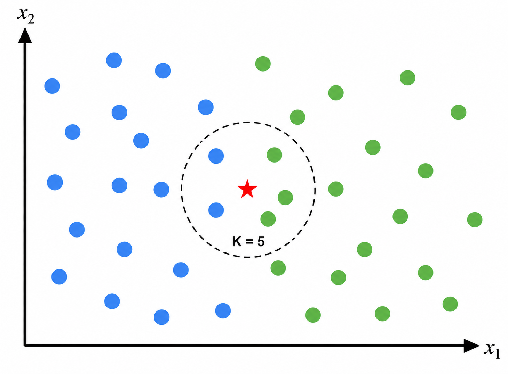
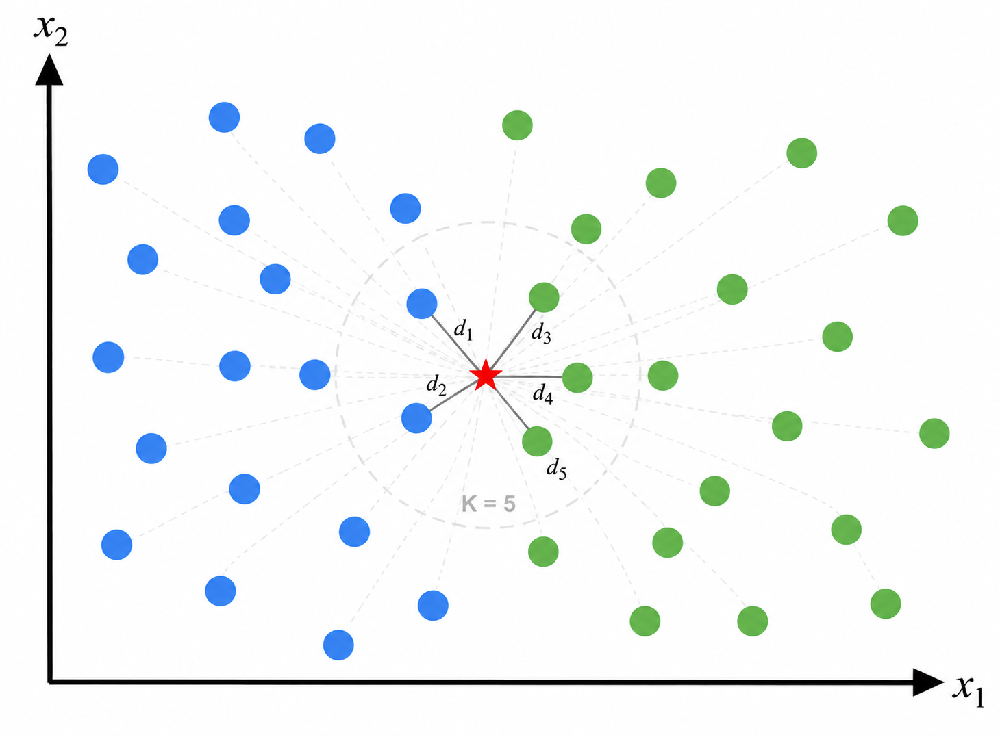
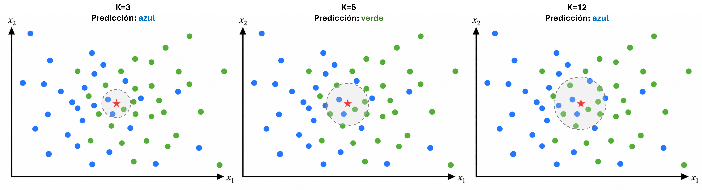
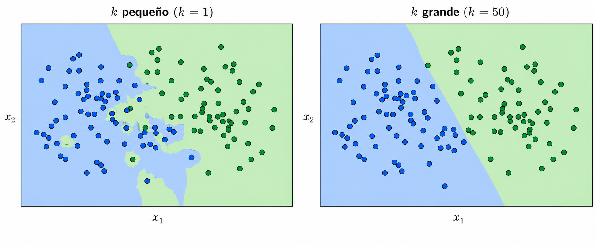
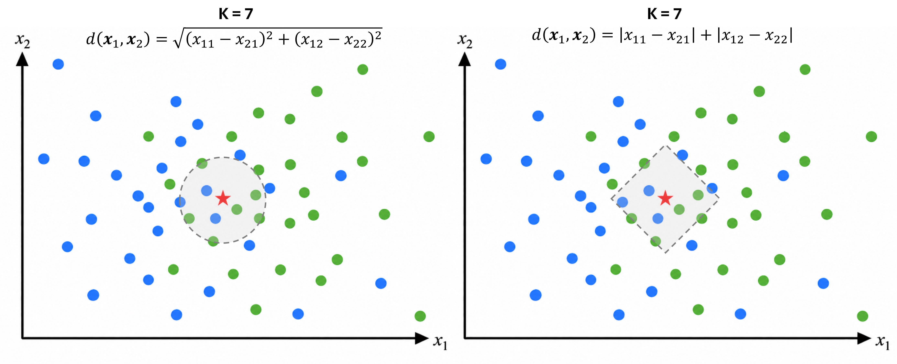

## Introducción

::::: columns
::: {.column width="50%"}
Supongamos que tenemos un problema de clasificación y queremos predecir la clase de una **nueva observación**.

**Idea**: buscar las observaciones **más parecidas** dentro de los datos conocidos.

Si la **mayoría** de los vecinos pertenece a cierta clase, predecimos la nueva observación como miembro de esta clase
:::

::: {.column width="50%"}
{width="100%"}
:::
:::::

::: formula
**K-Nearest Neighbors (KNN)** predice utilizando las $k$ observaciones más cercanas a una nueva observación.
:::

## ¿Qué significa "cercano"?

Para determinar cuáles observaciones son vecinas necesitamos definir una **distancia**. Algunas de las medidas más utilizadas son:

| Distancia | Definición |
|------------------------------------|------------------------------------|
| **Euclidiana** | $d(\mathbf x_i,\mathbf x_j)=\sqrt{\sum_{m=1}^{p}(x_{im}-x_{jm})^2}$ |
| **Manhattan** | $d(\mathbf x_i,\mathbf x_j)=\sum_{m=1}^{p}|x_{im}-x_{jm}|$ |
| **Minkowski** | $d(\mathbf x_i,\mathbf x_j)=\left(\sum_{m=1}^{p}|x_{im}-x_{jm}|^q\right)^{1/q}$ |

::: formula
Una menor distancia indica una mayor **similitud** según la métrica utilizada.

Por lo tanto, los $k$ vecinos seleccionados pueden cambiar dependiendo de la distancia elegida.
:::

## K-Nearest Neighbors

::::: columns
::: {.column width="50%"}
Para clasificar una nueva observación:

1.  Calculamos su distancia a cada observación de entrenamiento: $d_i=d(\mathbf{x},\mathbf{x}_i)$.

2.  Seleccionamos los $k$ vecinos más cercanos: $N_k(\mathbf{x})$.

3.  Observamos sus clases $y_i$.

4.  Asignamos la clase más frecuente:

$$
\hat y
=
\operatorname{mode}
\{y_i:\mathbf{x}_i\in N_k(\mathbf{x})\}.
$$

:::

::: {.column width="50%"}
{width="100%"}
:::
:::::

## Ejemplo

::: example
Queremos predecir si un cliente presenta **riesgo de impago** utilizando dos predictores:

- $x_1$: ingreso mensual (miles de pesos)
- $x_2$: deuda mensual (miles de pesos).

Un nuevo cliente tiene un **ingreso mensual de 15 mil pesos** y una **deuda mensual de 6 mil pesos**.

Utilizando $k=2$ y **distancia euclidiana**, **¿cuál será la clase predicha para el nuevo cliente?**
:::

## Ejemplo {.unlisted}

::: example
Las observaciones de entrenamiento son:

| Ingreso $x_1$ | Deuda $x_2$ | Riesgo |
|--------------:|------------:|--------|
|            10 |           8 | Alto   |
|            12 |           7 | Alto   |
|            18 |           5 | Bajo   |
|            20 |           4 | Bajo   |
|            22 |           6 | Bajo   |
:::

## El parámetro $k$

El número de vecinos utilizados afecta directamente las predicciones del modelo.

::: {style="height: 250px; margin: 20px 0 30px 0;"}

:::

Si utilizamos un valor pequeño de $k$, la predicción depende de observaciones muy cercanas. Si utilizamos un valor grande, intervienen observaciones cada vez más alejadas.

::: formula
$k$ es un **hiperparámetro** del modelo y normalmente se selecciona utilizando datos de validación.
:::

## El parámetro $k$ {.unlisted}

::: {style="height: 250px; margin: 15px 0 140px 0;"}

:::

::::: columns

::: {.column width="50%"}

**$k$ pequeño**

La predicción depende de **pocos vecinos**, por lo que la frontera puede adaptarse demasiado a los datos.

::: formula
Frontera **irregular** y mayor sensibilidad al **ruido**.
:::

:::

::: {.column width="50%"}

**$k$ grande**

La predicción considera **más vecinos**, suavizando la frontera y reduciendo el efecto de observaciones individuales.

::: formula
Frontera **suave**, pero puede perder **patrones locales**.
:::

:::

:::::

## La elección de $d$

Además de $k$, debemos elegir cómo medir la cercanía entre observaciones.

La función $d(\mathbf{x}_i,\mathbf{x}_j)$ determina qué observaciones serán consideradas vecinas.

::: {style="height: 250px; margin: 15px 0 180px 0;"}

:::

::: formula

Cambiar $d$ cambia la **geometría de la vecindad** y puede cambiar la **predicción del modelo**.

:::

## KNN para clasificación y regresión

KNN puede utilizarse tanto para **clasificación** como para **regresión**.

**Clasificación:** asignamos la clase más frecuente entre los $k$ vecinos:

$$
\hat y
=
\operatorname{mode}
\{y_i:\mathbf{x}_i\in\mathcal N_k(\mathbf{x})\}.
$$

**Regresión:** cuando la respuesta es continua, utilizamos el promedio:

$$
\hat y
=
\frac{1}{k}
\sum_{i\in\mathcal N_k(\mathbf{x})}
y_i.
$$

::: formula

En ambos casos utilizamos los mismos $k$ vecinos; lo que cambia es **cómo combinamos sus respuestas**.

:::

## Evaluación del modelo

Las métricas utilizadas dependen del tipo de problema:

| **Clasificación** | **Regresión** |
|---|---|
| Accuracy | MSE |
| Precision | RMSE |
| Recall | MAE |
| Matriz de confusión | $R^2$ |
| Curva ROC | - |

::: {.formula}
La métrica utilizada depende del problema y del tipo de error que sea más importante.
:::

## KNN es un modelo no paramétrico

KNN es un método de **aprendizaje supervisado no paramétrico**.

A diferencia de otros modelos que hemos estudiado, no supone una forma funcional específica ni estima un conjunto fijo de parámetros, como en

$$
\hat y=f(\mathbf x;\boldsymbol\theta).
$$

En su lugar, conserva los datos de entrenamiento y realiza la predicción utilizando las observaciones cercanas.

::: formula

KNN es un método basado en **instancias**: las predicciones dependen directamente de las observaciones almacenadas.

:::

## Limitaciones de KNN

KNN presenta algunas limitaciones importantes:

- **Costo computacional:** para cada nueva observación debe calcular distancias con las observaciones del conjunto de entrenamiento.

- **Escala:** variables con escalas mayores pueden dominar las distancias, por lo que es necesario **escalar los predictores**.

- **Alta dimensión:** las observaciones se vuelven más dispersas y las distancias menos informativas, fenómeno conocido como **maldición de la dimensionalidad**.

::: formula

KNN funciona mejor cuando existe una noción útil de **proximidad entre las observaciones**.

:::

## En resumen

- KNN es un método **supervisado y no paramétrico** basado en observaciones cercanas.

- La noción de cercanía depende de la **métrica de distancia** y de la **escala de los predictores**.

- $k$ controla qué tan **local** es la predicción y debe seleccionarse utilizando datos de validación.

- En **clasificación**, los vecinos votan; en **regresión**, sus respuestas se promedian.

- Es simple de entrenar, pero la **predicción puede ser costosa** y deteriorarse en alta dimensión.

::: formula

**Idea central:** observaciones similares deberían producir respuestas similares.

:::

## Referencias

::: {#refs}
:::

## Preguntas

::::::::: columns
::: {.column width="45%"}
{width="95%"}
:::

::::::: {.column width="55%"}
:::::: vcenter
::: fragment
¿Seguro? 🤨
:::

::: fragment
Bueno...
:::

::: fragment
Pregúntale a [ChatGPT](https://chatgpt.com) pues.
:::
::::::
:::::::
:::::::::

## ¿Qué sigue?

En el siguiente notebook implementaremos **K-Nearest Neighbors**, desde el escalamiento de los datos hasta la selección de $k$ mediante validación.

[**Ir al notebook →**](https://colab.research.google.com/github/urendacdenisse-hub/modelado-de-datos/blob/main/notebooks/unidad-01/notebook-08.ipynb)