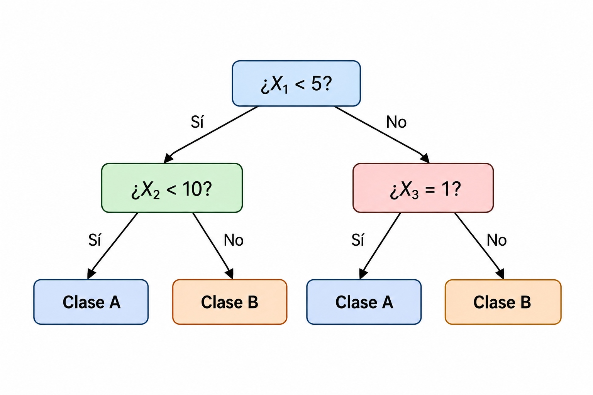
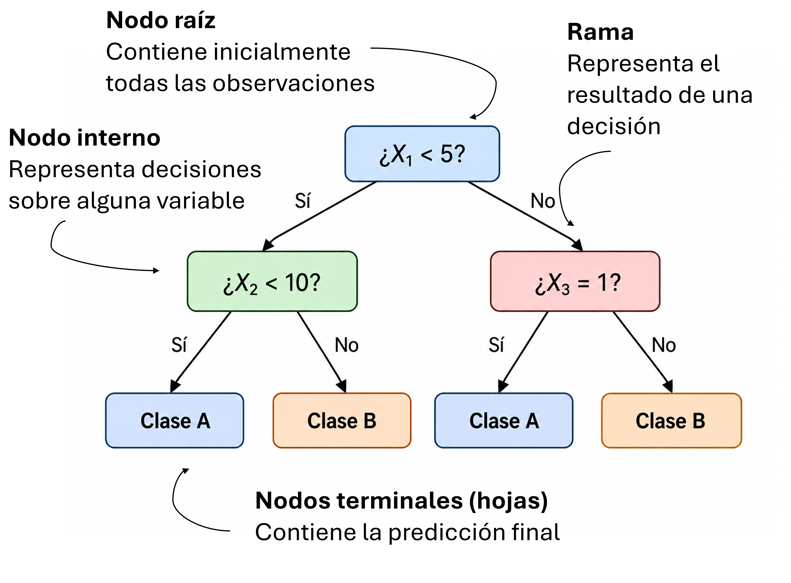
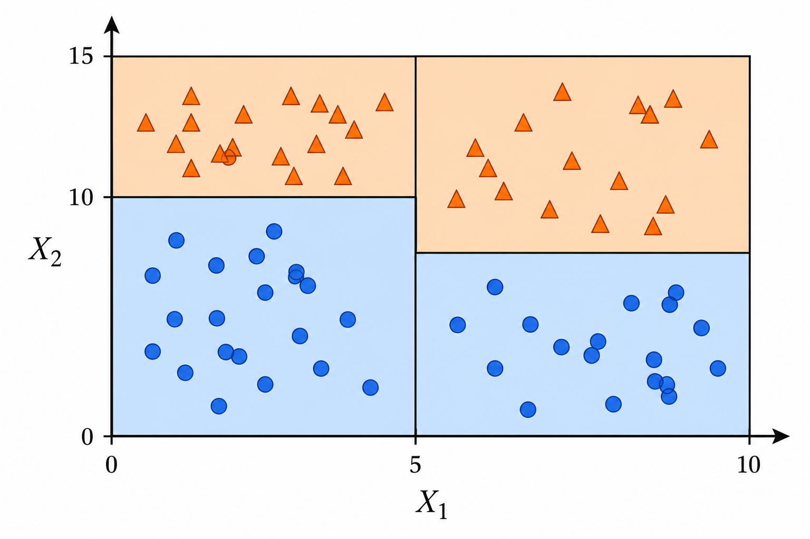
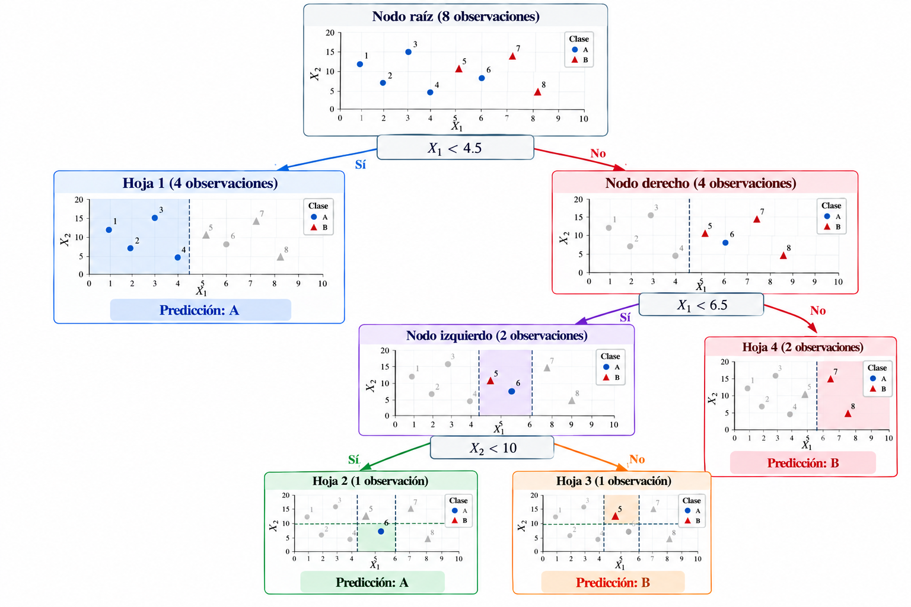
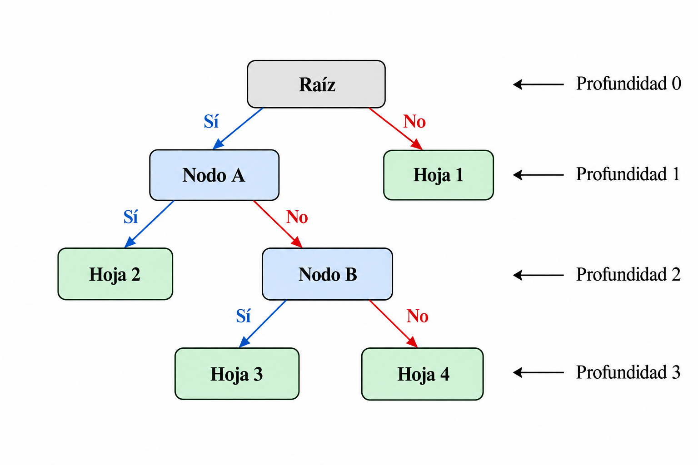

## Introducción

::::: columns
::: {.column width="50%"}
Supongamos que queremos predecir si una observación pertenece a una determinada clase.

Una estrategia consiste en realizar una serie de **preguntas sobre las variables predictoras**.

Por ejemplo:

- ¿$X_1 < 5$?
- ¿$X_2 < 10$?
- ¿$X_3 = 1$?

:::

::: {.column width="50%"}
{width="100%"}

Cada respuesta divide los datos en grupos cada vez más pequeños.
:::
:::::

::: formula
Un **árbol de decisión** realiza divisiones sucesivas de los datos utilizando las variables predictoras.
:::

## Estructura de un árbol

::::: columns
::: {.column width="30%"}
Un árbol de decisión está formado por:

- Nodo raíz
- Nodo interno
- Rama
- Nodos terminales u hojas
:::

::: {.column width="70%"}
{width="100%"}
:::
:::::

## De árbol a regiones

::::: columns
::: {.column width="50%"}
Cada división del árbol también puede interpretarse como una división del espacio de predictores.

Por ejemplo,

$$X_1 < 5$$

divide el espacio en dos regiones.

Posteriormente podemos dividir alguna de estas regiones utilizando otra variable.
:::

::: {.column width="50%"}
{width="100%"}
:::
:::::

::: formula
Un árbol divide el espacio de predictores en **regiones** y asigna una predicción a cada región.
:::

## ¿Dónde hacemos una división?

Supongamos que tenemos diferentes posibilidades:

$$
X_1 < 2,
\qquad
X_1 < 5,
\qquad
X_2 < 8,
\qquad \ldots
$$

Cada división genera dos nuevos grupos de observaciones.

Queremos elegir una división que produzca grupos **más homogéneos respecto a la variable respuesta**.

::: formula
El árbol busca la variable y el punto de corte que produzcan la **mejor separación de los datos**.
:::

## Impureza

En clasificación necesitamos medir qué tan mezcladas se encuentran las clases dentro de un nodo.

Consideremos:

$$
\text{Nodo A}: 
\quad
\text{Clase A}=50\%,
\quad
\text{Clase B}=50\%.
$$

Este nodo tiene alta impureza.

En cambio,

$$
\text{Nodo B}: 
\quad
\text{Clase A}=95\%,
\quad
\text{Clase B}=5\%.
$$

es mucho más homogéneo.

::: formula
Una buena división produce nodos con observaciones pertenecientes principalmente a **una misma clase**.
:::

## Índice Gini

Una medida común de impureza es el **índice Gini**.

Si existen $K$ clases, la impureza de un nodo se calcula como

$$
G=1-\sum_{k=1}^{K}p_k^2,
$$

donde $p_k$ representa la proporción de observaciones de la clase $k$ dentro del nodo.

::: formula
Un nodo completamente puro tiene $G=0$.
:::

## Índice Gini ponderado{.unlisted}
Para evaluar una división, calculamos el **índice Gini ponderado**:

$$
G_{\text{división}} =
\frac{n_L}{n}G_L +
\frac{n_R}{n}G_R,
$$

donde:

- $G_L$ y $G_R$ son los índices Gini de los nodos izquierdo y derecho.
- $n_L$ y $n_R$ son las observaciones en cada nodo.
- $n$ es el total de observaciones antes de la división.

::: formula
El **mejor corte** es aquel que minimiza el índice Gini ponderado.
:::

## Ejemplo: Comparación de dos cortes {.unlisted}

::::: columns
::: {.column width="50%"}
Supongamos el siguiente conjunto de datos:

| $X_1$ | $X_2$ | $X_3$ | Clase |
|:---:|:---:|:---:|:---:|
| 1 | 12 | 0 | A |
| 2 | 8  | 1 | A |
| 3 | 15 | 0 | A |
| 4 | 6  | 1 | A |
| 5 | 11 | 1 | B |
| 6 | 9  | 0 | A |
| 7 | 14 | 1 | B |
| 8 | 7  | 0 | B |
:::

::: {.column width="50%"}
Consideremos dos posibles divisiones del conjunto de datos:

- **Corte 1:** $X_1 < 4.5$
- **Corte 2:** $X_1 < 6.5$

**Determina cuál de los dos cortes es mejor** utilizando el índice Gini ponderado.
:::
:::::

## Construcción recursiva del árbol

El proceso se repite de manera recursiva:

1. **Evaluar posibles divisiones** sobre las variables predictoras: $X_j < c$

1. **Seleccionar el mejor corte**, minimizando el índice Gini ponderado:

   $$
   (j^*,c^*)=\arg\min_{j,c}
   \left[
   \frac{n_L}{n}G_L+
   \frac{n_R}{n}G_R
   \right]
   $$

2. **Dividir las observaciones** en dos nuevos nodos:

   $$
   R_L=\{x\in R:X_{j^*}<c^*\},
    \quad
   R_R=\{x\in R:X_{j^*}\geq c^*\}
   $$

3. **Repetir el procedimiento** dentro de cada nuevo nodo.

El crecimiento continúa hasta satisfacer algún **criterio de parada**.

::: formula
El árbol se construye mediante una secuencia de decisiones **localmente óptimas**.
:::

## Construcción recursiva del árbol {.unlisted}

{width="100%"}

## Profundidad del árbol

La **profundidad de un árbol** es el número máximo de divisiones (ramas) que se recorren desde el nodo raíz hasta una hoja. Por convención, el nodo raíz tiene profundidad $0$.

- **Árbol poco profundo:** realiza pocas divisiones y genera regiones relativamente grandes. Puede no capturar patrones complejos en los datos.

- **Árbol profundo:** realiza más divisiones y genera regiones más específicas. Puede ajustarse excesivamente a las observaciones de entrenamiento.

::: formula
La **profundidad** controla la complejidad del árbol y permite regular el equilibrio entre subajuste y sobreajuste.
:::

## Profundidad del árbol {.unlisted}

{width="100%"}

## Profundidad del árbol {.unlisted}

Si permitimos que el árbol continúe creciendo, puede llegar a construir hojas con muy pocas observaciones.

Esto permite ajustarse extremadamente bien a los datos de entrenamiento.

Sin embargo, puede producir un desempeño pobre sobre nuevas observaciones.

::: formula
Un árbol demasiado complejo puede producir **sobreajuste**.
:::

## Control de complejidad

Podemos controlar el crecimiento utilizando hiperparámetros como:

| Hiperparámetro      | Controla                                   |
|---------------------|--------------------------------------------|
| `max_depth`         | Profundidad máxima                         |
| `min_samples_split` | Observaciones mínimas para dividir un nodo |
| `min_samples_leaf`  | Observaciones mínimas en una hoja          |
| `max_leaf_nodes`    | Número máximo de hojas                     |

::: formula
Estos hiperparámetros controlan la **complejidad del árbol** y pueden seleccionarse utilizando validación cruzada.
:::

## ¿Y para regresión?

Los árboles también pueden utilizarse cuando la variable respuesta es continua.

En este caso, cada hoja contiene una predicción numérica.

Normalmente, la predicción corresponde al promedio de las observaciones de entrenamiento dentro de la región:

$$\hat y_R
=
\frac{1}{N_R}
\sum_{i:x_i\in R}y_i.$$

::: formula
**Clasificación:** cada hoja predice una clase.

**Regresión:** cada hoja predice un valor continuo.
:::

## Divisiones en regresión

En regresión ya no buscamos separar clases.

Buscamos divisiones que produzcan regiones donde los valores de $y$ sean similares.

Una forma de medir el error dentro de una región $R$ es

$$\text{SSE}_R
=
\sum_{i:x_i\in R}
(y_i-\hat y_R)^2.$$

El árbol busca divisiones que reduzcan este error.

::: formula
En regresión, una buena división genera regiones con valores de $y$ **más homogéneos**.
:::

## ¿Necesitamos escalar?

Consideremos una división:

$$X_j < c.$$

El árbol solamente necesita comparar el valor de una variable con un punto de corte.

Por esta razón, cambiar la escala de una variable no modifica fundamentalmente las posibles divisiones.

::: formula
A diferencia de KNN y SVM, los árboles de decisión generalmente **no requieren escalamiento de las variables predictoras**.
:::

## Interpretabilidad

Una ventaja importante de los árboles es que podemos visualizar directamente las decisiones utilizadas para realizar una predicción.

Esto permite observar:

- qué variables aparecen en las divisiones;
- qué condiciones conducen a una hoja;
- qué predicción realiza cada región.

::: formula
Los árboles pequeños pueden ser modelos **fácilmente interpretables**.
:::

## Evaluación

El desempeño de un árbol de decisión puede evaluarse utilizando diferentes métricas según el tipo de problema.

| **Clasificación** | **Regresión** |
|:---|:---|
| Accuracy | MSE |
| Precision | RMSE |
| Recall | MAE |
| Matriz de confusión | $R^2$ |
| Curva ROC | |

::: note
Los hiperparámetros del árbol deben seleccionarse utilizando validación cruzada.
:::

## Consideraciones prácticas

Antes de utilizar árboles de decisión debemos recordar:

- pueden utilizarse para **clasificación y regresión**;
- generalmente no requieren escalamiento;
- pueden representar relaciones no lineales;
- su complejidad debe controlarse para evitar sobreajuste;
- árboles pequeños son fáciles de interpretar;
- pequeñas modificaciones en los datos pueden producir árboles diferentes.

## Una limitación importante

Los árboles de decisión pueden tener **alta variabilidad**.

Una pequeña modificación en los datos de entrenamiento puede cambiar las primeras divisiones y producir un árbol considerablemente diferente.

::: formula
Podemos reducir esta variabilidad combinando las predicciones de **muchos árboles**.
:::

## Referencias

::: {#refs}
:::

## Preguntas

::::::::: columns
::: {.column width="45%"}
{width="95%"}
:::

::::::: {.column width="55%"}
:::::: vcenter
::: fragment
¿Seguro? 🤨
:::

::: fragment
Bueno...
:::

::: fragment
Pregúntale a [ChatGPT](https://chatgpt.com) pues.
:::
::::::
:::::::
:::::::::

## ¿Qué sigue?

En el siguiente notebook utilizaremos **Scikit-learn** para aplicar árboles de decisión a un conjunto de datos, evaluar su desempeño y analizar cómo la selección de diferentes **hiperparámetros** influye en los resultados del modelo.

[**Ir al notebook →**](https://colab.research.google.com/github/urendacdenisse-hub/modelado-de-datos/blob/main/notebooks/unidad-01/notebook-09.ipynb)