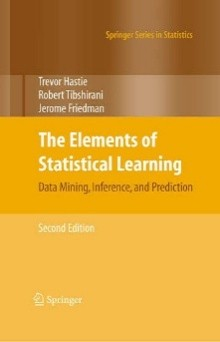
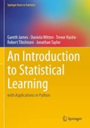
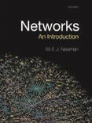

# Información del curso

| **Campo** | **Información** |
|------------|-----------------|
| **Nombre** | Análisis y modelado de datos en ciencias |
| **Clave** | CBE-2853-06 / CBE-9869-17 |
| **Semestre** | Agosto – Diciembre 2026 |
| **Créditos** | 8 |
| **Horas** | 4.00 |
| **Grupo** | A |
| **Horario** | Martes y jueves 4:00 pm – 6:00 pm |
| **Lugar** | Salón 103-H1-308 |

# Información del instructor

| **Campo** | **Información** |
|------------|-----------------|
| **Nombre** | Dra. Denisse Urenda Castañeda |
| **Correo electrónico** | denisse.urenda@uacj.mx |
| **Asesorías** | En línea, por medio de cita previa |

# Descripción del curso

Este curso introduce los fundamentos del análisis y modelado de datos aplicados a problemas científicos y de ingeniería. A lo largo del semestre, los estudiantes estudiarán técnicas de aprendizaje supervisado y no supervisado, métodos espectrales y análisis de grafos, comprendiendo tanto sus fundamentos matemáticos como su aplicación práctica. El curso combina teoría con un proyecto integrador, en el que los estudiantes desarrollarán un proyecto utilizando Python y documentarán de manera clara la metodología, las decisiones de diseño y los resultados obtenidos mediante un reporte técnico elaborado en Overleaf.

# Resultados de aprendizaje

Al finalizar el curso, el estudiante será capaz de:

- Formular problemas de análisis y modelado de datos a partir de preguntas científicas o de ingeniería. 

- Explorar, visualizar e interpretar conjuntos de datos para identificar patrones y generar hipótesis. 

- Seleccionar y aplicar técnicas de aprendizaje supervisado, aprendizaje no supervisado y análisis espectral de acuerdo con las características del problema. 

- Evaluar e interpretar críticamente el desempeño de diferentes modelos utilizando métricas y herramientas de validación apropiadas. 

- Desarrollar un proyecto reproducible utilizando Python y documentar el proceso seguido mediante un reporte técnico elaborado en Overleaf.

# Enfoque del curso

Este curso adopta un enfoque de aprendizaje basado en la resolución de problemas. Si bien la comprensión de los fundamentos matemáticos es esencial, el objetivo principal es desarrollar la capacidad de seleccionar y aplicar las herramientas adecuadas para analizar datos y responder preguntas científicas o de ingeniería. El aprendizaje se organiza alrededor de un proyecto semestral, el cual evoluciona conforme se introducen nuevas técnicas de análisis y modelado. En consecuencia, la evaluación se centra en la resolución de problemas, el desarrollo del proyecto y la comunicación clara de la metodología, las decisiones tomadas y los resultados obtenidos.

# Evaluación del curso

Durante el curso, la evaluación estará basada en cuestionarios y en un proyecto desarrollado a lo largo del semestre. A continuación, se muestra la rúbrica de evaluación.

| **Producto** | **Valor** |
|---------------|----------:|
| Quizzes (8) | 40% (5% cada uno) |
| Proyecto (3 entregables) | 60% (20% cada uno) |
| **Total** | **100%** |
| **Extra** | **5%**   |

## Sobre los quizzes

Los quizzes se aplicarán aproximadamente cada dos semanas, durante la primera hora de la sesión correspondiente, y evaluarán la comprensión de los conceptos discutidos en clase.

## Sobre el proyecto

Al inicio del curso, cada estudiante seleccionará un problema de análisis y modelado de datos que desarrollará durante todo el semestre. El proyecto se entregará en tres etapas distribuidas a lo largo del semestre, culminando con un reporte técnico elaborado en Overleaf.

## Sobre el puntaje extra

La asistencia no forma parte de la calificación ordinaria del curso. Sin embargo, como reconocimiento al compromiso y la participación constante, se otorgará un porcentaje adicional sobre la calificación final conforme a los siguientes criterios:

- Asistencia perfecta: +5% sobre la calificación final. 
- Hasta dos faltas o cuatro retardos: +3% sobre la calificación final.

# Cronograma del curso
El siguiente cronograma establece las fechas, los temas, las secciones y las actividades que se abordarán durante el curso.



# Recursos y herramientas del curso

El material del curso estará disponible en el repositorio de [GitHub](https://github.com/urendacdenisse-hub/Modelado-de-datos), donde se publicarán las presentaciones, notebooks, conjuntos de datos y recursos complementarios. Los notebooks estarán desarrollados en [Google Colab](https://colab.research.google.com/) y servirán como apoyo para reproducir los ejemplos y experimentos presentados durante el curso.

El proyecto semestral deberá documentarse mediante un reporte técnico elaborado en [Overleaf](https://es.overleaf.com/), siguiendo una estructura similar a la de un artículo científico. El objetivo del reporte es desarrollar la capacidad de comunicar de manera clara el problema abordado, la metodología empleada, las decisiones tomadas y los resultados obtenidos.

**Nota**: *No se requiere experiencia previa con Google Colab, GitHub ni Overleaf. Las herramientas necesarias se introducirán gradualmente conforme avance el curso.*

# Uso de inteligencia artificial

El uso de herramientas de inteligencia artificial generativa (por ejemplo, ChatGPT, Claude, Gemini o GitHub Copilot) está permitido y es alentado como apoyo para el aprendizaje. Sin embargo, estas herramientas deben utilizarse de manera crítica y responsable. **Los estudiantes son responsables de comprender, validar y poder explicar cualquier solución presentada en el proyecto.**

# Bibliografía

Durante el curso, los libros enlistados a continuación servirán como material de apoyo para complementar los temas presentados en clase.

:::: {.columns}

::: {.column width="20%"}

[{width=80%}](https://hastie.su.domains/ElemStatLearn/)

:::

::: {.column width="80%"}
## The Elements of Statistical Learning (ESL)

Hastie, T., Tibshirani, R., & Friedman, J. (2009). *The Elements of Statistical Learning: Data Mining, Inference, and Prediction* (2nd ed.). Springer.

<https://hastie.su.domains/ElemStatLearn/>

:::

::::

:::: {.columns}

::: {.column width="20%"}

[{width=80%}](https://www.statlearning.com/)

:::

::: {.column width="80%"}

## Introduction to Statistical Learning with Applications in Python (ISLP)

James, G., Witten, D., Hastie, T., Tibshirani, R., & Taylor, J. (2023). *An Introduction to Statistical Learning: With Applications in Python*. Springer.

<https://www.statlearning.com/>

:::

::::

:::: {.columns}

::: {.column width="20%"}

[{width=80%}](https://academic.oup.com/book/27303)

:::

::: {.column width="80%"}

## Networks: An Introduction

Newman, M. E. J. (2010). *Networks: An Introduction*. Oxford University Press.

:::

::::